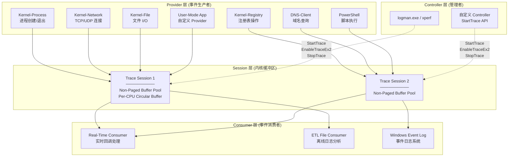
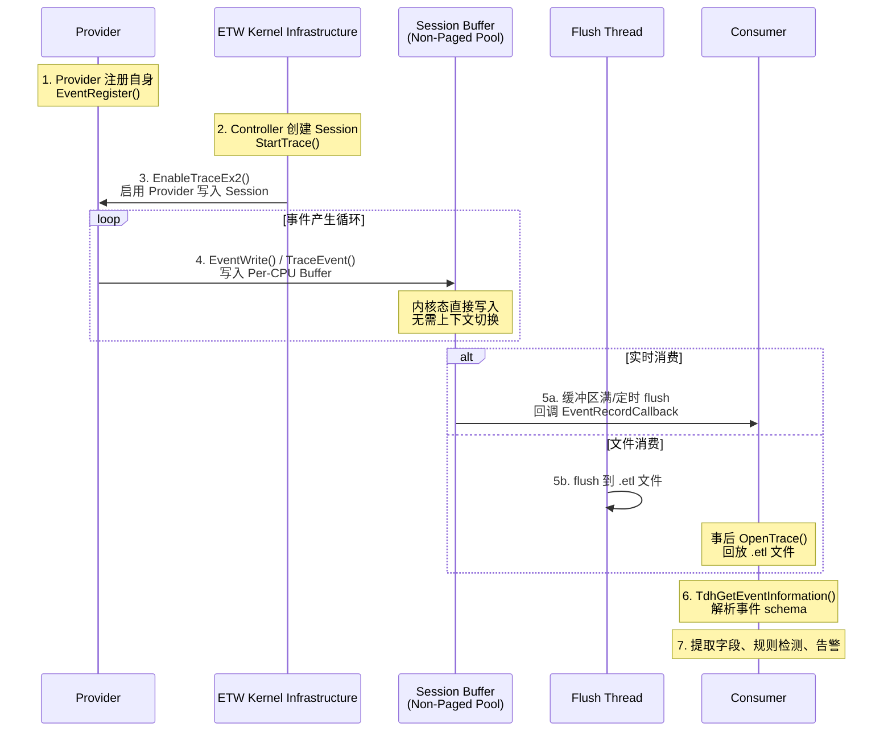
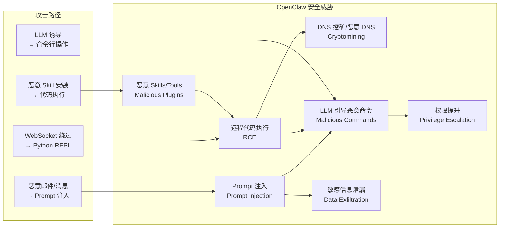
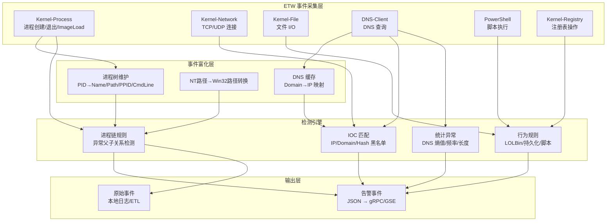
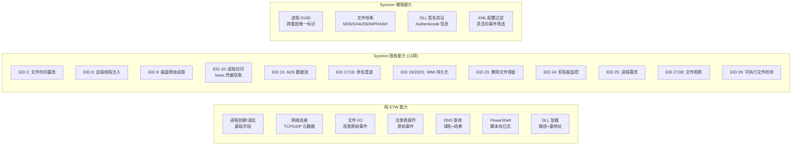
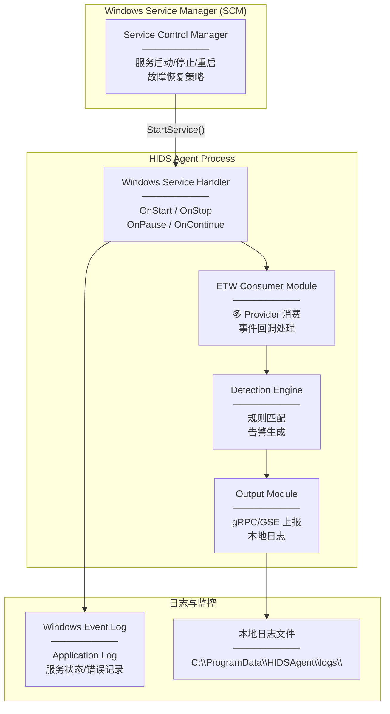

# Windows ETW 深度解析：架构、安全检测与工程实践

## 面向 OpenClaw/LLM 场景的 HIDS 基础设施

Posted by pandaychen on March 23, 2026

---

## 0x00 前言

Event Tracing for Windows（ETW）是 Windows 操作系统内建的高性能事件跟踪基础设施，从 Windows 2000 起引入，经过二十余年的演进，已成为 Windows 平台上最重要的可观测性机制。对于熟悉 Linux 生态的开发者而言，**ETW 之于 Windows，正如 eBPF 之于 Linux**——它们都提供了从内核到用户态的统一事件采集管道，且都不需要修改被监控程序的代码。

本文的写作背景和目标：

```
背景约束：
├── 平台: Windows 10/11 云桌面 (~1w 台)
├── 安全产品: 无 EDR
├── 技术路线: ETW 优先 (纯用户态，无内核驱动)
├── 开发语言: Go (主力) / Rust (在学，可选)
├── LLM 场景: OpenClaw 原生进程 → 远程 LLM 调用
└── 目标: 采集 + 检测 + 告警 (不拦截)
```

本文将从以下几个维度进行深入讲解：

1. **ETW 架构与核心组件**：Provider、Controller、Session、Consumer 四大角色的职责与交互
2. **安全监控核心 Provider**：6 个关键 Provider 的 GUID、事件 ID、字段含义
3. **OpenClaw 安全威胁模型**：结合真实 CVE 和攻击面，构建 ETW 检测矩阵
4. **开发语言与开源方案评估**：Go vs Rust 的全维度对比
5. **Sysmon 增益分析**：使用与不使用 Sysmon 的能力差异对比
6. **Win10/11 部署方案**：类 Linux 常驻后台服务的完整部署指南

> 参考资料：[Microsoft ETW 官方文档](https://learn.microsoft.com/en-us/windows/win32/etw/about-event-tracing)、[ETW Provider Names and GUIDs](https://learn.microsoft.com/en-us/archive/blogs/dcook/etw-provider-names-and-guids)、[repnz/etw-providers-docs](https://github.com/repnz/etw-providers-docs)

## 0x01 ETW 架构概览

#### 三层架构模型

ETW 的架构由四个核心角色组成，形成一个 **Provider → Session → Consumer** 的数据管道，其中 Controller 负责 Session 的生命周期管理：



#### 内核态与用户态双层覆盖

ETW 同时覆盖内核态和用户态两个层面：

| 层面 | 数据来源 | 典型事件 | 性能特点 |
|------|----------|----------|----------|
| **内核态** | 内核内建的 Provider（如 Kernel-Process/Network/File/Registry） | 进程创建、线程调度、磁盘 I/O、网络连接、中断、上下文切换 | 零拷贝写入内核缓冲区，极低开销 |
| **用户态** | 应用程序注册的 Provider（如 PowerShell、DNS-Client、.NET CLR） | 脚本执行、DNS 查询、GC 事件、HTTP 请求 | 通过 `NtTraceEvent` 系统调用写入内核缓冲区 |

两个层面的事件最终都汇入同一个 Session 的内核缓冲区，Consumer 无需区分事件来源。

#### ETW 事件的完整生命周期



#### ETW 与 Windows Event Log 的关系

很多初学者容易混淆 ETW 和 Windows Event Log（事件日志），它们的关系如下：

```
ETW (底层传输管道)
  └── Windows Event Log (上层日志存储)
        ├── Application Log
        ├── Security Log (需要 audit policy)
        ├── System Log
        ├── Microsoft-Windows-PowerShell/Operational
        └── Microsoft-Windows-Sysmon/Operational
```

- **ETW** 是底层的事件传输基础设施，提供高性能、低延迟的实时事件流
- **Windows Event Log** 是建立在 ETW 之上的日志持久化系统，将特定 ETW 事件写入 `.evtx` 文件
- 并非所有 ETW 事件都会写入 Event Log——实际上大部分高频内核事件（如 Kernel-File 每秒数千条）不会写入 Event Log
- 安全监控推荐 **直接消费 ETW 实时流**，而非读取 Event Log，因为 ETW 实时流延迟更低且信息更完整

#### 关键 Win32 API

| API | 角色 | 功能 |
|-----|------|------|
| `StartTrace` | Controller | 创建并启动一个 Trace Session |
| `EnableTraceEx2` | Controller | 在 Session 中启用指定 Provider，设置 Level/Keyword 过滤 |
| `ControlTrace` | Controller | 查询/更新/停止 Session |
| `StopTrace` | Controller | 停止并销毁 Session |
| `EventRegister` | Provider | 注册一个 Provider，获取注册句柄 |
| `EventWrite` | Provider | 向 Session 写入一个事件 |
| `OpenTrace` | Consumer | 打开一个 Session（实时）或 ETL 文件 |
| `ProcessTrace` | Consumer | 阻塞式消费事件，调用回调函数 |
| `TdhGetEventInformation` | Consumer | 解析事件 schema（Trace Data Helper） |

## 0x02 核心组件详解

### Provider（事件提供者）

Provider 是 ETW 事件的生产者，负责在特定条件下生成事件数据。Windows 系统内建了超过 **1100 个** Provider，涵盖内核、网络、存储、安全、应用等几乎所有子系统。

#### Provider 的四种类型

| 类型 | 引入版本 | 特点 | 典型代表 |
|------|----------|------|----------|
| **MOF (Classic)** | Windows 2000 | 最早的 Provider 类型，使用 WMI MOF 定义事件 schema | NT Kernel Logger |
| **WPP (Windows Software Trace Preprocessor)** | Windows XP | 面向驱动/内核开发的 trace 宏，编译时生成 | 各种内核驱动的 debug trace |
| **Manifest-based** | Windows Vista | 使用 XML manifest 定义事件 schema，支持结构化数据 | Microsoft-Windows-Kernel-Process、DNS-Client |
| **TraceLogging** | Windows 10 | 自描述事件，无需预定义 manifest，schema 嵌入事件数据 | 现代 Windows 组件 |

在安全监控场景中，主要消费的是 **Manifest-based** 和 **TraceLogging** 类型的 Provider。

#### GUID 体系

每个 Provider 通过一个全局唯一的 GUID 来标识。例如：

```
Microsoft-Windows-Kernel-Process : {22FB2CD6-0E7B-422B-A0C7-2FAD1FD0E716}
Microsoft-Windows-DNS-Client     : {1C95126E-7EEA-49A9-A3FE-A378B03DDB4D}
```

可通过以下方式查询系统中注册的 Provider：

```powershell
# 列出所有已注册的 Provider
logman query providers

# 查询特定 Provider 的详细信息（支持的 Keyword、Level）
logman query providers "Microsoft-Windows-Kernel-Process"

# PowerShell 方式
Get-EtwTraceProvider
```

#### Keyword 与 Level 过滤

Provider 支持两个维度的事件过滤，在 `EnableTraceEx2` 时设置：

**Level（级别）**：控制事件的详细程度

| Level 值 | 名称 | 含义 |
|-----------|------|------|
| 1 | Critical | 严重错误 |
| 2 | Error | 一般错误 |
| 3 | Warning | 警告 |
| 4 | Informational | 常规信息 |
| 5 | Verbose | 详细调试信息 |

**Keyword（关键字）**：64 位位掩码，每个 bit 代表一类事件。以 Kernel-Process 为例：

| Keyword | 值 | 事件类型 |
|---------|----|----------|
| WINEVENT_KEYWORD_PROCESS | 0x10 | 进程创建/退出 |
| WINEVENT_KEYWORD_THREAD | 0x20 | 线程创建/退出 |
| WINEVENT_KEYWORD_IMAGE | 0x40 | 映像加载/卸载 |
| WINEVENT_KEYWORD_CPU_PRIORITY | 0x80 | CPU 优先级变更 |
| WINEVENT_KEYWORD_OTHER_PRIORITY | 0x100 | 其他优先级变更 |

通过组合 Keyword 可以精确控制订阅的事件类型，避免不必要的高频事件（如线程事件每秒可达数万条）。

### Controller（控制器）

Controller 负责 Trace Session 的全生命周期管理，它不消费事件，只负责"指挥"。

#### Controller 的核心职责

1. **创建 Session**：调用 `StartTrace` 分配内核缓冲区
2. **启用 Provider**：调用 `EnableTraceEx2` 将 Provider 绑定到 Session
3. **配置参数**：设置缓冲区大小、flush 间隔、日志文件路径
4. **停止 Session**：调用 `StopTrace` 释放资源

#### 常用 Controller 工具

| 工具 | 来源 | 用途 |
|------|------|------|
| `logman.exe` | Windows 内建 | 管理 ETW Session，查询 Provider，启停 trace |
| `xperf.exe` | Windows Performance Toolkit | 性能分析专用，支持内核 trace |
| `tracert.exe` / `tracelog.exe` | WDK | 驱动开发 trace |
| `wpr.exe` | Windows Performance Recorder | 图形化 trace 录制 |

典型操作示例：

```batch
:: 创建一个实时 Session 并启用 Kernel-Process Provider
logman create trace "MySecurityTrace" -p "Microsoft-Windows-Kernel-Process" 0x10 4 -ets

:: 查询当前活跃的 Session
logman query -ets

:: 停止 Session
logman stop "MySecurityTrace" -ets
```

#### 编程接口

在 Go 中使用 `SEKOIA-IO/etw` 库时，Session 创建和 Provider 启用被封装为：

```go
session, err := etw.NewSession()
if err != nil {
    log.Fatal(err)
}
defer session.Close()

guid, _ := windows.GUIDFromString("{22FB2CD6-0E7B-422B-A0C7-2FAD1FD0E716}")
if err := session.AddProvider(guid); err != nil {
    log.Fatal(err)
}
```

底层对应的是 `StartTrace` + `EnableTraceEx2` 的调用序列。

### Session（会话/缓冲区）

Session 是 ETW 架构中最核心的数据流转载体，它在内核空间维护一组缓冲区，接收 Provider 写入的事件数据。

#### Session 内存模型

```
Session "MyTrace"
├── Per-CPU Buffer[0]  ←── CPU 0 上的 Provider 写入
├── Per-CPU Buffer[1]  ←── CPU 1 上的 Provider 写入
├── Per-CPU Buffer[2]  ←── CPU 2 上的 Provider 写入
├── ...
└── Per-CPU Buffer[N-1]
    │
    ├── 非分页内存 (Non-Paged Pool)
    │   → 确保中断上下文中也能写入
    │   → 不会被换出到磁盘
    │
    ├── 环形缓冲区 (Circular Buffer)
    │   → 缓冲区满时覆盖最旧的事件（文件模式下 flush 到磁盘）
    │
    └── 无锁写入
        → Per-CPU 设计消除了 CPU 间的锁竞争
        → Provider 写入时无需跨 CPU 同步
```

#### Session 关键参数

| 参数 | 默认值 | 说明 |
|------|--------|------|
| BufferSize | 64 KB | 每个缓冲区的大小 |
| MinimumBuffers | CPU 数量 + 2 | 最小缓冲区数量 |
| MaximumBuffers | MinimumBuffers + 20 | 最大缓冲区数量 |
| FlushTimer | 1 秒 | 缓冲区 flush 周期 |
| LogFileMode | 实时/文件/循环 | Session 的工作模式 |

#### Session 数量限制

- Windows 系统最多支持 **64 个并发 ETW Session**（包括系统自身使用的）
- 实际可用的约为 **56-60 个**（系统和安全工具会占用若干）
- 每个 Session 可以绑定 **多个 Provider**
- 建议安全监控使用 **1-3 个 Session**，按 Provider 频率分组（高频/低频分离）

#### 特殊 Session

| Session 名称 | 特点 |
|--------------|------|
| **NT Kernel Logger** | 系统预留的唯一一个内核 trace session，用于采集 CPU/Disk/Network 等底层内核事件。注意：现代 Windows (Win8+) 已不再要求使用此 session，可通过普通 session 启用 Kernel Provider |
| **AutoLogger** | 在系统启动时自动创建的 Session，由注册表 `HKLM\SYSTEM\CurrentControlSet\Control\WMI\Autologger` 配置，可以捕获开机阶段的事件 |
| **EventLog-*\*** | Windows Event Log 服务内部使用的 Session，将 ETW 事件转存为 .evtx 文件 |

### Consumer（事件消费者）

Consumer 从 Session 中读取和处理事件，支持两种消费模式。

#### 实时消费 vs ETL 文件消费

| 维度 | 实时消费 (Real-Time) | 文件消费 (ETL) |
|------|---------------------|----------------|
| 延迟 | 毫秒级 | 事后分析 |
| API | `OpenTrace` + `ProcessTrace` (实时模式) | `OpenTrace` + `ProcessTrace` (文件模式) |
| 数据完整性 | 可能丢失（缓冲区满时） | 完整（写入文件后消费） |
| 适用场景 | 安全监控、实时告警 | 性能分析、事件回放、取证 |
| 多 Consumer | 一个 Session 只能有一个实时 Consumer | ETL 文件可被多个 Consumer 读取 |

对于 HIDS 安全监控，推荐使用 **实时消费** 模式。

#### 回调机制

Consumer 通过注册 `EventRecordCallback` 回调函数来接收事件。每当 Session 缓冲区中有新事件时，ETW 基础设施会在 Consumer 的线程上调用此回调：

```go
// SEKOIA-IO/etw 的回调模式
session.Process(func(e *etw.Event) {
    // e.Header 包含: EventID, ProcessID, ThreadID, TimeStamp, ProviderID
    // e.EventProperties() 解析事件的结构化字段
    props, _ := e.EventProperties()
    // 处理事件...
})
```

#### TDH（Trace Data Helper）解析

ETW 原始事件是二进制格式，需要通过 TDH API 解析为可读的字段名-值对：

```
原始事件 (二进制)
    │
    ▼
TdhGetEventInformation()  →  获取事件 schema (字段名、类型、偏移)
    │
    ▼
TdhFormatProperty()       →  将原始字节解析为: PID=1234, ImageName="cmd.exe", ...
```

在 Go 库中，`e.EventProperties()` 已经封装了这个流程，直接返回 `map[string]interface{}`。

## 0x03 安全监控核心 Provider 详解

本节详细介绍 HIDS 安全监控所需的 6 个核心 ETW Provider，包括每个 Provider 的 GUID、核心事件 ID、以及每个事件包含的字段及其含义。

### 3.1 Microsoft-Windows-Kernel-Process

进程/线程/映像（DLL/EXE）生命周期的核心 Provider，是安全监控的第一优先级数据源。

```
Provider:  Microsoft-Windows-Kernel-Process
GUID:      {22FB2CD6-0E7B-422B-A0C7-2FAD1FD0E716}
Level:     Informational (4)
Keywords:  PROCESS=0x10, THREAD=0x20, IMAGE=0x40
```

#### Event ID 1: ProcessStart（进程创建）

**安全意义**：最重要的安全事件之一，用于检测恶意进程启动、异常父子关系、LOLBin 利用

| 字段名 | 类型 | 含义 |
|--------|------|------|
| ProcessID | UInt32 | 新创建进程的 PID |
| ParentProcessID | UInt32 | 父进程 PID |
| ImageName | UnicodeString | 进程映像的 NT 路径（如 `\Device\HarddiskVolume3\Windows\System32\cmd.exe`） |
| CommandLine | UnicodeString | 完整命令行参数 |
| UserSID | SID | 运行用户的安全标识符 |
| SessionID | UInt32 | 登录会话 ID（0=SYSTEM 会话） |
| CreateTime | FILETIME | 进程创建时间戳 |
| Flags | UInt32 | 创建标志位 |
| MandatoryLabel | SID | 完整性级别标签 |
| PackageFullName | UnicodeString | UWP 应用包名（桌面应用为空） |

实际代码中提取这些字段的方式：

```go
props, _ := e.EventProperties()
pid := getUint32(props, "ProcessID")
ppid := getUint32(props, "ParentProcessID")
imageName := getString(props, "ImageName")  // NT 路径
cmdline := getString(props, "CommandLine")
userSID := getString(props, "UserSID")
```

#### Event ID 2: ProcessStop（进程退出）

**安全意义**：完成进程生命周期追踪，用于计算进程存活时长（短命进程可能是恶意工具执行后自删除）

| 字段名 | 类型 | 含义 |
|--------|------|------|
| ProcessID | UInt32 | 退出进程的 PID |
| ImageName | UnicodeString | 进程映像路径 |
| ExitCode | UInt32 | 退出码（0=正常） |
| CreateTime | FILETIME | 进程创建时间 |
| ExitTime | FILETIME | 进程退出时间 |
| KernelTime | UInt64 | 内核态 CPU 时间 |
| UserTime | UInt64 | 用户态 CPU 时间 |
| ExitStatus | UInt32 | NT 状态码 |

#### Event ID 3: ThreadStart（线程创建）

**安全意义**：检测远程线程注入（Thread Injection）——一个进程在另一个进程中创建线程

| 字段名 | 类型 | 含义 |
|--------|------|------|
| ProcessID | UInt32 | 线程所属进程的 PID |
| ThreadID | UInt32 | 新创建线程的 TID |
| StartAddr | Pointer | 线程起始地址 |
| Win32StartAddr | Pointer | Win32 层面的起始地址 |
| StackBase | Pointer | 线程栈基址 |
| StackLimit | Pointer | 线程栈限制地址 |
| SubProcessTag | UInt32 | 服务标签（区分 svchost 中的不同服务） |

> 注意：线程事件量极大（每秒可达数万条），安全监控中通常只关注跨进程的远程线程创建。但纯 ETW 无法直接区分本地线程和远程线程，这是 Sysmon EID 8 的增值所在。

#### Event ID 5: ImageLoad（映像加载）

**安全意义**：检测 DLL 侧加载（DLL Side-Loading）、DLL 注入、恶意 DLL 加载

| 字段名 | 类型 | 含义 |
|--------|------|------|
| ProcessID | UInt32 | 加载映像的进程 PID |
| ImageBase | Pointer | 映像加载基地址 |
| ImageSize | Pointer | 映像大小 |
| ImageName | UnicodeString | DLL/EXE 的完整路径 |
| ImageChecksum | UInt32 | PE 校验和 |
| TimeDateStamp | UInt32 | PE 时间戳 |
| DefaultBase | Pointer | 首选加载基址 |
| SignatureLevel | UInt32 | 签名级别 |
| SignatureType | UInt32 | 签名类型 |

#### Event ID 6: ImageUnload（映像卸载）

字段与 ImageLoad 基本一致，记录 DLL 卸载事件，安全价值较低。

### 3.2 Microsoft-Windows-Kernel-Network

网络连接的核心 Provider，提供 TCP/UDP 连接级别的事件。

```
Provider:  Microsoft-Windows-Kernel-Network
GUID:      {7DD42A49-5329-4832-8DFD-43D979153A88}
Level:     Informational (4)
```

#### Event ID 12: ConnectionAttempted（TCP 连接尝试 / 出站）

**安全意义**：检测恶意外连（C2 通信、数据外泄、矿池连接）

| 字段名 | 类型 | 含义 |
|--------|------|------|
| PID | UInt32 | 发起连接的进程 PID |
| size | UInt32 | 数据包大小 |
| daddr | IPv4/IPv6 | 目标 IP 地址 |
| saddr | IPv4/IPv6 | 源 IP 地址 |
| dport | UInt16 | 目标端口 |
| sport | UInt16 | 源端口 |
| connid | Pointer | 连接标识符 |

#### Event ID 15: ConnectionAccepted（TCP 连接接受 / 入站）

字段与 ConnectionAttempted 相同，记录入站连接。

**安全意义**：检测反向 shell、未授权的监听端口、横向移动的入站连接。

#### Event ID 10 / 11: DataSent / DataReceived

| 字段名 | 类型 | 含义 |
|--------|------|------|
| PID | UInt32 | 进程 PID |
| size | UInt32 | 发送/接收的字节数 |
| connid | Pointer | 连接标识符（关联到具体连接） |

#### Event ID 42 / 43: DataSentOverUDP / DataReceivedOverUDP

UDP 协议的数据收发事件，字段与 TCP 类似，额外包含 `daddr`/`dport`/`saddr`/`sport`。

**安全意义**：检测 DNS over UDP（虽然 DNS-Client Provider 更适合）、UDP 隧道。

### 3.3 Microsoft-Windows-Kernel-File

文件系统操作的核心 Provider，提供细粒度的文件 I/O 事件。

```
Provider:  Microsoft-Windows-Kernel-File
GUID:      {EDD08927-9CC4-4E65-B970-C2560FB5C289}
Level:     Informational (4)
Keywords:  FILENAME=0x10, FILEIO=0x20, OP_END=0x40
```

| Event ID | 名称 | 安全意义 |
|----------|------|----------|
| 10 | NameCreate | 文件/目录名创建（注意：这是文件名的内核对象创建，不等同于文件创建） |
| 11 | NameDelete | 文件/目录名删除 |
| 12 | Create | 文件打开操作（`CreateFile` 调用） |
| 13 | Cleanup | 文件句柄关闭前的清理 |
| 14 | Close | 文件句柄关闭 |
| 15 | Read | 文件读取操作 |
| 16 | Write | 文件写入操作 |
| 17 | SetInformation | 设置文件属性 |
| 18 | SetDelete | 标记文件删除 |
| 19 | Rename | 文件重命名 |
| 20 | DirEnum | 目录枚举 |
| 30 | CreateNewFile | 创建新文件 |

#### 核心事件字段（以 Create / Read / Write 为例）

| 字段名 | 类型 | 含义 |
|--------|------|------|
| IrpPtr | Pointer | I/O 请求包指针（用于关联 OperationEnd） |
| FileObject | Pointer | 文件对象内核指针 |
| FileKey | Pointer | 文件唯一标识 |
| TTID | UInt32 | 发起操作的线程 ID |
| CreateOptions | UInt32 | 创建选项标志位 |
| FileAttributes | UInt32 | 文件属性 |
| ShareAccess | UInt32 | 共享访问模式 |
| OpenPath | UnicodeString | 文件完整路径 |
| Offset | UInt64 | 读写偏移量（Read/Write 事件） |
| IoSize | UInt32 | I/O 大小 |
| IoFlags | UInt32 | I/O 标志位 |

> **性能警告**：Kernel-File 是所有 Provider 中事件量最大的，**每秒可产生数千到数万条事件**。生产环境必须做严格的路径过滤（只关注敏感目录如 `%TEMP%`、`%APPDATA%`、用户目录等）。

### 3.4 Microsoft-Windows-Kernel-Registry

注册表操作的核心 Provider。

```
Provider:  Microsoft-Windows-Kernel-Registry
GUID:      {70EB4F03-C1DE-4F73-A051-33D13D5413BD}
Level:     Informational (4)
```

| Event ID | 名称 | 安全意义 |
|----------|------|----------|
| 1 | CreateKey | 创建注册表项 — 检测持久化（Run/RunOnce 键）、服务注册 |
| 2 | OpenKey | 打开注册表项 |
| 3 | DeleteKey | 删除注册表项 |
| 4 | QueryKey | 查询注册表项 |
| 5 | SetValue | 设置注册表值 — **最重要**，检测自启动项修改、服务创建 |
| 6 | DeleteValue | 删除注册表值 |
| 7 | QueryValue | 查询注册表值 |
| 8 | EnumerateKey | 枚举子项 |
| 13 | CloseKey | 关闭注册表项 |

#### 核心事件字段

| 字段名 | 类型 | 含义 |
|--------|------|------|
| KeyObject | Pointer | 注册表键的内核对象指针 |
| Status | UInt32 | 操作返回状态（NTSTATUS） |
| BaseName | UnicodeString | 注册表路径的基础名 |
| RelativeName | UnicodeString | 相对路径名 |
| KeyName | UnicodeString | 完整的注册表路径（需要通过 KeyObject 反向解析） |

> **注意**：Kernel-Registry Provider 的路径字段是内核对象格式（如 `\REGISTRY\MACHINE\SOFTWARE\...`），需要转换为用户态格式（如 `HKLM\SOFTWARE\...`）。

**安全关注的关键注册表路径**：

```
持久化路径:
├── HKLM\SOFTWARE\Microsoft\Windows\CurrentVersion\Run
├── HKCU\SOFTWARE\Microsoft\Windows\CurrentVersion\Run
├── HKLM\SOFTWARE\Microsoft\Windows\CurrentVersion\RunOnce
├── HKLM\SYSTEM\CurrentControlSet\Services\*
└── HKLM\SOFTWARE\Microsoft\Windows NT\CurrentVersion\Winlogon

计划任务:
└── HKLM\SOFTWARE\Microsoft\Windows NT\CurrentVersion\Schedule\TaskCache

安全策略:
└── HKLM\SYSTEM\CurrentControlSet\Control\Lsa
```

### 3.5 Microsoft-Windows-DNS-Client

DNS 查询的 Provider，是网络安全检测的重要数据源。

```
Provider:  Microsoft-Windows-DNS-Client
GUID:      {1C95126E-7EEA-49A9-A3FE-A378B03DDB4D}
Level:     Informational (4)
```

#### Event ID 3008: QueryInitiated（DNS 查询发起）

| 字段名 | 类型 | 含义 |
|--------|------|------|
| QueryName | UnicodeString | 查询的域名（如 `evil.example.com`） |
| QueryType | UInt32 | DNS 记录类型编号 |

#### Event ID 3006: QueryCompleted（DNS 查询完成）

| 字段名 | 类型 | 含义 |
|--------|------|------|
| QueryName | UnicodeString | 查询的域名 |
| QueryType | UInt32 | DNS 记录类型编号 |
| QueryStatus | UInt32 | 查询状态（0=成功，9003=NXDOMAIN） |
| QueryResults | UnicodeString | 查询结果（IP 地址等，多个结果以分号分隔） |

**DNS 记录类型编号对照表**：

| QueryType 值 | 名称 | 含义 |
|--------------|------|------|
| 1 | A | IPv4 地址 |
| 2 | NS | 域名服务器 |
| 5 | CNAME | 别名记录 |
| 6 | SOA | 权威起始记录 |
| 12 | PTR | 反向解析 |
| 15 | MX | 邮件交换 |
| 16 | TXT | 文本记录（常被滥用于 DNS 隧道） |
| 28 | AAAA | IPv6 地址 |
| 33 | SRV | 服务定位 |
| 65 | HTTPS | HTTPS 服务绑定 |
| 255 | ANY | 查询所有类型 |

**安全检测场景**：

| 检测目标 | QueryName 特征 |
|----------|---------------|
| 矿池连接 | `*pool*`, `*xmr*`, `*monero*`, `*mining*` |
| DGA 域名 | 高熵随机字符串域名 |
| DNS 隧道 | 超长子域名 + 高频 TXT 查询 |
| C2 通信 | 已知恶意域名黑名单匹配 |
| 恶意重定向 | 查询结果包含已知恶意 IP |

> **优势**：DNS-Client 事件包含 **ProcessID** 信息（在 Event Header 中），可以关联到发起 DNS 查询的具体进程。结合进程树，可以追溯到完整的 OpenClaw → Python → DNS 查询链路。

实际代码中的处理方式：

```go
func handleDNSQueryCompleted(e *etw.Event) {
    props, _ := e.EventProperties()
    queryName := getString(props, "QueryName")
    queryType := getUint32(props, "QueryType")
    queryStatus := getUint32(props, "QueryStatus")
    queryResults := getString(props, "QueryResults")

    // e.Header.ProcessID 即为发起 DNS 查询的进程 PID
    // 可通过进程树查找进程名和完整链
    if info, ok := ptree.Lookup(e.Header.ProcessID); ok {
        procName = info.ExeName
    }
}
```

### 3.6 Microsoft-Windows-PowerShell

PowerShell 脚本执行的 Provider，对于检测 LLM 引导的恶意脚本至关重要。

```
Provider:  Microsoft-Windows-PowerShell
GUID:      {A0C1853B-5C40-4B15-8766-3CF1C58F985A}
Channel:   Microsoft-Windows-PowerShell/Operational
```

#### Event ID 4104: ScriptBlockLogging（脚本块日志）

**安全意义**：记录完整的 PowerShell 脚本内容，是检测无文件攻击（fileless attack）的关键数据源

| 字段名 | 类型 | 含义 |
|--------|------|------|
| ScriptBlockId | GUID | 脚本块唯一标识（大脚本拆分时用于关联） |
| ScriptBlockText | UnicodeString | **脚本内容**（最关键的字段） |
| Path | UnicodeString | 脚本文件路径（交互式输入为空） |
| MessageNumber | UInt32 | 分片序号（大脚本拆为多个事件） |
| MessageTotal | UInt32 | 分片总数 |

> **重要限制**：ETW 单事件最大约 **64 KB**，PowerShell 脚本超过约 32 KB 时会拆分为多个 4104 事件。需要根据 `ScriptBlockId` 拼接还原完整脚本。

#### Event ID 4105 / 4106: ScriptBlock Invocation Start / Complete

记录脚本块的执行开始和结束，包含 `ScriptBlockId` 和 `RunspaceId`，用于构建执行时间线。

#### PowerShell ETW 的特殊性

PowerShell ScriptBlock Logging 需要 **显式启用**（Windows 默认不记录）：

```
方法一: 组策略 (推荐批量部署)
  Computer Configuration
  → Administrative Templates
  → Windows Components
  → Windows PowerShell
  → Turn on PowerShell Script Block Logging: Enabled

方法二: 注册表
  HKLM\SOFTWARE\Policies\Microsoft\Windows\PowerShell\ScriptBlockLogging
  EnableScriptBlockLogging = 1
```

启用后，所有 PowerShell 执行都会被记录，包括：
- 交互式命令
- 脚本文件执行
- `-EncodedCommand` 编码执行（会被解码后记录）
- 模块中的函数调用

## 0x04 ETW 事件枚举与发现

在开发 ETW 消费程序之前，需要知道系统中有哪些 Provider 可用，以及每个 Provider 提供哪些事件。

### 命令行枚举

```powershell
# 列出系统所有已注册的 Provider（通常 1100+ 个）
logman query providers

# 查询特定 Provider 的详细信息
logman query providers "Microsoft-Windows-Kernel-Process"
# 输出: GUID, Keywords, Levels, 关联的 Session 等

# 列出当前活跃的 ETW Session
logman query -ets

# PowerShell: 列出网络相关的 Provider
Get-NetEventProvider -ShowInstalled | Where-Object {$_.Name -like "*DNS*"}
```

### ETW Explorer 工具

[ETW Explorer](https://github.com/zodiacon/EtwExplorer)（Pavel Yosifovich 开发）是一个图形化的 ETW Provider 浏览工具，可以：

- 浏览所有已注册的 Provider
- 查看每个 Provider 的事件 schema（事件 ID、字段名、字段类型）
- 实时监听 Provider 的事件输出

### etw-providers-docs 项目

[repnz/etw-providers-docs](https://github.com/repnz/etw-providers-docs) 项目导出了 Windows 10 各版本所有 Provider 的 XML Manifest，是最完整的 ETW 事件 schema 参考。

例如 Kernel-File Provider 的 Manifest 片段：

```xml
<event value="12" symbol="Create" version="0"
       channel="Microsoft-Windows-Kernel-File/Analytic"
       level="win:Informational"
       task="PERFINFO_LOG_TYPE_FILE_IO_CREATE"
       keywords="KEYWORD_FILEIO">
  <template tid="FileCreate">
    <data name="IrpPtr" inType="win:Pointer"/>
    <data name="FileObject" inType="win:Pointer"/>
    <data name="TTID" inType="win:UInt32"/>
    <data name="CreateOptions" inType="win:UInt32"/>
    <data name="FileAttributes" inType="win:UInt32"/>
    <data name="ShareAccess" inType="win:UInt32"/>
    <data name="OpenPath" inType="win:UnicodeString"/>
  </template>
</event>
```

### 运行时 Provider 发现

SEKOIA-IO/etw 库支持通过名称查找 Provider GUID：

```go
// 通过名称查找 Provider GUID（无需硬编码）
guid, err := etw.ProviderGUIDFromName("Microsoft-Windows-DNS-Client")
```

## 0x05 OpenClaw 安全威胁模型

OpenClaw 是当前最流行的开源 AI 助手框架，但其架构设计存在严重的安全隐患。截至 2026 年 2 月，公开数据显示：

- **40,000 - 135,000+** 个 OpenClaw 实例暴露在公网
- **93.4%** 的公开实例存在关键认证绕过（反向代理配置错误）
- **CVE-2026-25253**（高危）：WebSocket 认证绕过，Guest 模式保留 Python REPL 权限

### 威胁清单

基于 OpenClaw 的架构特性和公开漏洞，在 Win10/11 云桌面环境中需要关注以下威胁：



### 各威胁详细说明

#### 1. Prompt 注入 (Prompt Injection)

**攻击方式**：通过聊天消息、邮件 hook、Skill 输出等途径注入恶意指令，诱导 LLM 执行非预期操作。OpenClaw 的安全策略明确指出 prompt injection "explicitly out-of-scope"，这意味着框架本身不做任何防御。

**攻击示例**：恶意邮件通过 Gmail hook 被 OpenClaw 读取 → 邮件内容包含隐藏的 prompt 指令 → LLM 执行 Python REPL 调用 → 零点击 RCE。

#### 2. 远程代码执行 (RCE)

**CVE-2026-25253**：WebSocket 连接缺少 Authorization header 时，服务端降级为 Guest 模式，但 Guest 仍保留调用 Python REPL 等工具的权限。加上缺少 Origin header 校验，攻击者可通过钓鱼页面触发。

**默认危险权限**：OpenClaw 默认允许 agent 执行任意 shell 命令、读写文件、自动化浏览器、修改自身配置（SOUL.md）。

#### 3. DNS 挖矿 / 恶意 DNS

**攻击方式**：通过 RCE 或恶意 Skill 下载挖矿程序，连接矿池域名。或者通过 DNS 隧道进行 C2 通信。

#### 4. LLM 引导恶意命令执行

**攻击方式**：LLM 在处理恶意输入后，通过 OpenClaw 的 shell 执行能力运行 `powershell.exe -enc <base64>`、`certutil -urlcache`、`bitsadmin /transfer` 等 LOLBin 命令。

#### 5. 敏感信息泄漏

**攻击方式**：LLM 被诱导读取 API 密钥、凭据文件、环境变量等敏感数据，并通过聊天消息或网络请求外泄。Moltbook 事件中已有 **150 万 API token** 被泄漏的先例。

#### 6. 恶意 Skills / Tools

**攻击方式**：OpenClaw 支持从外部源下载和安装 Skill，恶意 Skill 可能包含后门代码。安装后，Skill 在 OpenClaw 进程的权限上下文中运行。

## 0x06 ETW 检测矩阵

### 风险 → Provider → 事件 → 检测规则 映射

| 威胁 | 主要 Provider | 事件 | 检测逻辑 | 置信度 |
|------|--------------|------|----------|--------|
| **RCE / 恶意命令执行** | Kernel-Process | EID 1 ProcessStart | OpenClaw 进程树（python.exe/node.exe）下派生 cmd.exe/powershell.exe | 高 |
| **Encoded PS 执行** | Kernel-Process | EID 1 ProcessStart | CommandLine 包含 `-enc`/`-encodedcommand` | 高 |
| **LOLBin 利用** | Kernel-Process | EID 1 ProcessStart | certutil/mshta/rundll32/regsvr32 + 可疑参数 | 高 |
| **DNS 挖矿** | DNS-Client | EID 3006 QueryCompleted | QueryName 匹配矿池域名模式 (`*pool*`, `*xmr*`, `*monero*`) | 高 |
| **DGA 域名** | DNS-Client | EID 3006 QueryCompleted | 域名长度异常 + 字符熵值高 + 非常见 TLD | 中 |
| **DNS 隧道** | DNS-Client | EID 3006/3008 | 高频 TXT 查询 + 超长子域名 (>40字符) | 中 |
| **C2 外连** | Kernel-Network | EID 12 ConnectionAttempted | 目标 IP/端口匹配 IOC 黑名单 | 高 |
| **数据外泄** | Kernel-Network | EID 10 DataSent | 大量数据发送到非业务 IP + Kernel-File 读敏感文件 | 中 |
| **敏感文件读取** | Kernel-File | EID 15 Read / EID 12 Create | 读取 `.env`/`credentials`/`*key*`/`*token*` 等路径 | 中 |
| **文件投放** | Kernel-File | EID 30 CreateNewFile | 在 `%TEMP%`/`%APPDATA%` 下创建 .exe/.dll/.ps1/.bat | 高 |
| **持久化** | Kernel-Registry | EID 5 SetValue | 修改 Run/RunOnce/Services 注册表键 | 高 |
| **恶意脚本** | PowerShell | EID 4104 ScriptBlock | 脚本内容匹配：`Net.WebClient`/`IEX`/`Invoke-Expression`/`[Convert]::FromBase64String` | 高 |
| **恶意 DLL** | Kernel-Process | EID 5 ImageLoad | 非系统目录 DLL 加载 + 未签名 | 中 |
| **宏攻击** | Kernel-Process | EID 1 ProcessStart | Office 进程（winword/excel）派生 shell 或脚本引擎 | 高 |

### 检测流程图



### 示例检测规则（Go 伪代码）

以下是结合现有 PoC 代码的检测规则示例：

#### 规则 1：OpenClaw 进程链 Shell 派生

```go
{
    Name:        "OPENCLAW_SHELL_SPAWN",
    Description: "OpenClaw 进程树下启动了 shell/脚本引擎",
    Check: func(info *ProcessInfo, parent *ProcessInfo, chain []*ProcessChainNode) bool {
        shells := map[string]bool{"cmd.exe": true, "powershell.exe": true, "pwsh.exe": true}
        if !shells[strings.ToLower(info.ExeName)] {
            return false
        }
        for _, node := range chain {
            exe := strings.ToLower(node.ExeName)
            if strings.Contains(exe, "python") || strings.Contains(exe, "node") {
                return true
            }
        }
        return false
    },
}
```

#### 规则 2：DNS 矿池域名检测

```go
func checkMiningDNS(queryName string) bool {
    patterns := []string{
        "pool.", "xmr.", "monero", "mining", "miner",
        "stratum+tcp", "nicehash", "ethermine", "f2pool",
        "antpool", "viabtc", "nanopool",
    }
    lower := strings.ToLower(queryName)
    for _, p := range patterns {
        if strings.Contains(lower, p) {
            return true
        }
    }
    return false
}
```

#### 规则 3：PowerShell 恶意脚本检测

```go
func checkMaliciousScript(scriptText string) []string {
    var alerts []string
    suspiciousPatterns := map[string]string{
        `Net\.WebClient`:         "网络下载器",
        `DownloadString`:         "远程脚本加载",
        `DownloadFile`:           "远程文件下载",
        `Invoke-Expression`:      "动态代码执行",
        `IEX\s*\(`:              "动态代码执行(简写)",
        `FromBase64String`:       "Base64 解码执行",
        `-enc\s`:                "编码命令执行",
        `Start-BitsTransfer`:    "BITS 文件传输",
        `Invoke-WmiMethod`:      "WMI 远程执行",
        `New-ScheduledTask`:     "创建计划任务",
    }
    for pattern, desc := range suspiciousPatterns {
        matched, _ := regexp.MatchString("(?i)"+pattern, scriptText)
        if matched {
            alerts = append(alerts, desc)
        }
    }
    return alerts
}
```

### ETW 检测的能力边界

以下场景 ETW 无法直接检测，需要补充其他手段：

| 场景 | ETW 局限 | 补充方案 |
|------|----------|----------|
| 进程内存注入（Process Hollowing） | Kernel-Process 只记录线程创建，不记录内存写入 | Sysmon EID 25 / 内核驱动 |
| 加密流量内容 | Kernel-Network 只记录连接元数据 | 网络流量解密 / SSL 检查 |
| Prompt 注入的语义分析 | ETW 不理解自然语言 | LLM 安全层 / 输入过滤 |
| 用户行为意图 | ETW 只记录系统事件 | UEBA / 用户行为分析 |
| ETW Patching / Bypass | 攻击者可在用户态 hook `ntdll!NtTraceEvent` | 内核态 ETW 保护 / Sysmon |
| DLL 签名验证 | Kernel-Process EID 5 有签名级别但不如 Sysmon 完整 | Sysmon EID 7 / WDAC |

## 0x07 Go vs Rust ETW 开发方案对比

### 五维评估

#### 1. 稳定性

| 维度 | Go | Rust |
|------|-----|------|
| GC 影响 | STW 暂停可达 1-5ms，高频事件下可能丢失 | 无 GC，确定性延迟 |
| 运行时成熟度 | Go runtime 在 Windows 上非常成熟 | Rust std 在 Windows 上成熟，但 async runtime (tokio) 偶有 Windows 特有 bug |
| ETW 库稳定性 | SEKOIA-IO/etw 在生产环境有案例（SEKOIA SOC 平台） | ferrisetw 虽然标记 WIP 但核心功能稳定 |
| 崩溃恢复 | panic recover 可以捕获大部分异常 | panic 默认 abort，但可配置 unwind |

**结论**：Go 在当前阶段更稳定，适合快速上线；Rust 在长期运行的低延迟场景更优。

#### 2. 运行安全性

| 维度 | Go | Rust |
|------|-----|------|
| 内存安全 | 有 GC，但 CGO/unsafe 场景有风险 | 编译期保证，unsafe 块可审计 |
| ETW 交互层 | SEKOIA-IO/etw 无需 CGO，纯 Go 调用 Windows API | ferrisetw 基于 `windows-rs`，FFI 层薄 |
| 数据竞争 | `-race` 检测器优秀，但运行时开销大 | 编译期检查，零运行时开销 |
| unsafe 占比 | SEKOIA-IO/etw 中 ~5% unsafe（Windows syscall） | ferrisetw 中 ~8% unsafe（FFI 和缓冲区操作） |

**结论**：两者在 ETW 场景的安全性相当；Rust 的编译期保证更强，但 Go 的 unsafe 占比更低。

#### 3. 部署

| 维度 | Go | Rust |
|------|-----|------|
| 二进制大小 | ~8-12 MB（含 runtime） | ~3-5 MB（strip 后） |
| 交叉编译 | `GOOS=windows GOARCH=amd64 go build` 一条命令 | 需要安装 `x86_64-pc-windows-msvc` target + linker |
| 从 Linux 交叉编译 | 完美支持（SEKOIA-IO/etw 无 CGO） | 需要 `xwin` 或 Windows SDK，配置复杂 |
| Windows Service | `golang.org/x/sys/windows/svc` 官方支持 | `windows-service` crate 可用 |
| 依赖管理 | `go mod`，简单清晰 | `cargo`，同样优秀 |

**结论**：Go 在交叉编译和部署便利性上明显占优。

#### 4. 功能性

| 功能 | Go (SEKOIA-IO/etw) | Rust (ferrisetw) |
|------|---------------------|-------------------|
| 实时消费 | 支持 | 支持 |
| ETL 文件消费 | 不支持 | 支持 |
| 多 Provider 单 Session | 支持 | 支持 |
| Keyword/Level 过滤 | 支持 | 支持 |
| 事件 Schema 解析 | 自动（TDH） | 自动（TDH） |
| Kernel Trace | 支持 | 支持 |
| Provider 名称查找 | 支持 | 支持 |
| 异步消费 | goroutine（天然） | tokio async |

**结论**：功能覆盖基本一致，ferrisetw 额外支持 ETL 文件消费。

#### 5. 开源方案成熟度

| 维度 | Go 生态 | Rust 生态 |
|------|---------|-----------|
| ETW 消费库 | 3 个（SEKOIA-IO 最佳） | 1 个（ferrisetw） |
| 完整 EDR 方案 | WHIDS（依赖 Sysmon） | Rustinel（纯 ETW） |
| 社区活跃度 | Go ETW 库社区不活跃 | ferrisetw 和 Rustinel 活跃 |
| 文档质量 | SEKOIA-IO/etw 文档简略 | ferrisetw docs.rs 文档完整 |

### 开源项目详细对比

#### Go 生态

| 项目 | Stars | 许可证 | 最后更新 | CGO 依赖 | 多 Provider | 状态 | 说明 |
|------|-------|--------|----------|----------|-------------|------|------|
| **[SEKOIA-IO/etw](https://github.com/SEKOIA-IO/etw)** | ~10 | MIT | 2023-02 | **无需 CGO** | 支持 | 低活跃 | bi-zone/etw 增强 fork；添加了 Provider 名称查找、Session 过滤、多 Provider 注册。**推荐用于自研 Agent** |
| **[bi-zone/etw](https://github.com/bi-zone/etw)** | 74 | MIT | 2022-07 | **需要 CGO + mingw-w64** | 不支持 | 停维 | 原始实现；使用 C 代码解析事件；功能基础但稳定 |
| **[0xrawsec/golang-etw](https://github.com/0xrawsec/golang-etw)** | 45 | GPL-3.0 | 2022-09 | 无需 CGO | 支持 | 停维 | WHIDS 底层库；GPL 许可证限制商用；API 为 Session+Consumer 分离模式 |
| **[0xrawsec/WHIDS](https://github.com/0xrawsec/whids)** | 1,296 | AGPL-3.0 | 2023-02 | 依赖 golang-etw | - | 低活跃 | 完整 Windows EDR；**依赖 Sysmon** 做内核事件采集；含 Manager Server；支持 ATT&CK；每日可处理 15M 事件。作者声明 "best effort" 维护 |
| **[mandiant/SilkETW](https://github.com/mandiant/SilkETW)** | 826 | Apache-2.0 | 2024-08 | C# 实现 | 支持 | **已归档** | Mandiant/FireEye 出品；研究工具定位；JSON 输出；适合威胁研究，不适合生产部署 |

#### Rust 生态

| 项目 | Stars | 许可证 | 最后更新 | 依赖 | 状态 | 说明 |
|------|-------|--------|----------|------|------|------|
| **[n4r1b/ferrisetw](https://github.com/n4r1b/ferrisetw)** | 87 | MIT/Apache-2.0 | 2025-10 | `windows-rs` | 活跃 | KrabsETW 的 Rust 移植；20 位贡献者；支持实时+ETL+Kernel Trace；crates.io 累计 47,800 下载；标记 WIP 但核心稳定。**推荐作为 Rust ETW 库** |
| **[Karib0u/Rustinel](https://github.com/Karib0u/rustinel)** | 95 | Apache-2.0 | 2026-03 | ferrisetw | **活跃** | 完整 EDR Agent；**纯 ETW 无 Sysmon**；Sigma+YARA 双引擎；9 类事件（进程/网络/文件/注册表/DNS/PS/WMI/Services/Tasks）；Sysmon 兼容 schema；ECS NDJSON 输出；热加载规则。**最值得参考的 Rust EDR 方案** |
| **[microsoft/rust_win_etw](https://github.com/microsoft/rust_win_etw)** | - | MIT | - | - | 维护 | 微软官方 Rust ETW **Provider**（用于发送事件，不是消费）；不适合安全监控场景 |

### 推荐决策

```
决策矩阵:
├── 短期 (1-3 个月): Go + SEKOIA-IO/etw
│   ├── 理由: 团队 Go 熟练，无需 CGO，交叉编译方便
│   ├── 风险: 库不够活跃，可能需要自行修复 bug
│   └── 产出: 快速落地 Process+DNS+Network 基础监控
│
├── 中期 (3-6 个月): 评估 Rust + ferrisetw
│   ├── 理由: Rust 在安全工具领域有明显优势
│   ├── 参考: Rustinel 的架构和实现
│   └── 产出: 核心 ETW 消费模块用 Rust 重写
│
└── 长期: 根据实际需求选择
    ├── 如果纯采集: Go 足够
    └── 如果需要深度检测/响应: Rust 更合适
```

## 0x08 Sysmon 深度对比分析

Sysmon（System Monitor）是 Microsoft Sysinternals 工具套件中的系统监控工具，通过安装内核驱动来增强 Windows 的事件记录能力，并将事件写入 `Microsoft-Windows-Sysmon/Operational` Event Log。

### Sysmon 完整事件 ID 列表（截至 2025 版本，共 29 个）

| EID | 事件名称 | 说明 | 纯 ETW 替代方案 |
|-----|----------|------|-----------------|
| 1 | **Process Create** | 进程创建，含完整命令行、哈希(MD5/SHA256/IMPHASH)、进程 GUID、父进程信息 | Kernel-Process EID 1（无哈希、无 GUID） |
| 2 | **File Creation Time Changed** | 文件创建时间被修改（timestomping 检测） | **无替代** |
| 3 | **Network Connection** | TCP/UDP 连接，含进程 GUID 关联，默认禁用 | Kernel-Network EID 10-43 |
| 4 | **Sysmon Service State Changed** | Sysmon 服务自身状态变更 | N/A |
| 5 | **Process Terminated** | 进程退出 | Kernel-Process EID 2 |
| 6 | **Driver Loaded** | 驱动加载，含签名信息 | **无直接替代**（Kernel-Process EID 5 仅部分覆盖） |
| 7 | **Image Loaded** | DLL 加载，含**签名验证**和哈希 | Kernel-Process EID 5（无签名验证、无哈希） |
| 8 | **CreateRemoteThread** | **远程线程创建**（代码注入检测） | **无替代**（Kernel-Process EID 3 无法区分本地/远程线程） |
| 9 | **RawAccessRead** | 磁盘原始读取（绕过文件系统） | **无替代** |
| 10 | **ProcessAccess** | **进程间访问**（凭据窃取检测，如 lsass.exe 访问） | **无替代** |
| 11 | **FileCreate** | 文件创建 | Kernel-File EID 30 |
| 12 | **RegistryEvent (Create/Delete)** | 注册表键创建/删除 | Kernel-Registry EID 1/3 |
| 13 | **RegistryEvent (Value Set)** | 注册表值修改 | Kernel-Registry EID 5 |
| 14 | **RegistryEvent (Rename)** | 注册表键/值重命名 | Kernel-Registry（部分覆盖） |
| 15 | **FileCreateStreamHash** | NTFS 交替数据流创建（ADS 检测） | **无替代** |
| 16 | **Sysmon Config State Changed** | Sysmon 配置变更 | N/A |
| 17 | **PipeEvent (Create)** | **命名管道创建** | **无替代** |
| 18 | **PipeEvent (Connect)** | **命名管道连接** | **无替代** |
| 19 | **WmiEvent (Filter)** | **WMI 事件过滤器创建** | **无替代**（需 WMI ETW Provider，配置复杂） |
| 20 | **WmiEvent (Consumer)** | **WMI 事件消费者创建** | **无替代** |
| 21 | **WmiEvent (Binding)** | **WMI 过滤器-消费者绑定** | **无替代** |
| 22 | **DNS Query** | DNS 查询 | DNS-Client EID 3006/3008 |
| 23 | **FileDelete (Archived)** | 文件删除（**保存被删文件副本**） | **无替代**（文件内容保存是 Sysmon 独有能力） |
| 24 | **Clipboard Change** | **剪贴板内容变更** | **无替代** |
| 25 | **Process Tampering** | **进程映像篡改**（Process Hollowing/Herpaderping 检测） | **无替代** |
| 26 | **File Delete Logged** | 文件删除事件记录 | Kernel-File EID 18 |
| 27 | **File Block Executable** | **阻止可执行文件创建**（主动防御） | **无替代**（ETW 仅采集不拦截） |
| 28 | **File Block Shredding** | **阻止文件粉碎** | **无替代** |
| 29 | **File Executable Detected** | 可执行文件检测 | **无替代** |

### 能力矩阵对比



### 关键差异分析

#### 对 OpenClaw 安全检测的影响

| 检测场景 | 纯 ETW 效果 | 加 Sysmon 增益 |
|----------|-------------|---------------|
| OpenClaw → shell 派生 | **可检测** (Kernel-Process EID 1) | 增加进程 GUID、哈希、更完整的命令行 |
| PowerShell 编码执行 | **可检测** (EID 4104 + EID 1) | 无显著增益 |
| LOLBin 利用 | **可检测** (Kernel-Process EID 1) | 增加文件哈希辅助确认 |
| DNS 挖矿 | **可检测** (DNS-Client EID 3006) | Sysmon EID 22 更简洁但无增益 |
| DLL 注入 | **部分检测** (EID 5 ImageLoad) | **显著增益**: Sysmon EID 7 带签名验证 |
| 进程注入 (Hollowing) | **无法检测** | **关键能力**: Sysmon EID 8/10/25 |
| WMI 持久化 | **无法检测** | **关键能力**: Sysmon EID 19/20/21 |
| 命名管道 (C2 通信) | **无法检测** | **关键能力**: Sysmon EID 17/18 |
| 凭据窃取 (lsass) | **无法检测** | **关键能力**: Sysmon EID 10 |

#### Sysmon 的代价

| 维度 | 影响 |
|------|------|
| **部署复杂度** | 需要安装驱动（`sysmon64.exe -i config.xml`），需要管理员权限 + 驱动签名信任 |
| **配置管理** | 需要维护 XML 配置文件，不同终端可能需要不同配置 |
| **性能开销** | 中等，取决于配置。全量事件可能占用 5-10% CPU |
| **更新维护** | 需要定期更新 Sysmon 版本 + 更新配置 |
| **被攻击面** | Sysmon 驱动本身可能被绕过（驱动卸载、配置篡改、BYOVD） |
| **许可证** | Sysmon 是免费工具，但不开源 |

#### Win11 原生 Sysmon 集成

值得注意的是，Microsoft 正在将 Sysmon 原生集成到 Windows 11 和 Windows Server 2025 中：

- 无需单独安装 Sysmon
- 保留相同的事件类型（EID 1-29）
- 通过 Windows Feature 启用
- 仍然需要 XML 配置

> 但安全研究表明，即使是原生集成的 Sysmon，仍然无法有效抵御 EDR Killer 攻击（BYOVD、内核级 ETW 篡改等）。需要配合 HVCI（Hypervisor-Protected Code Integrity）和驱动黑名单使用。

### 建议策略

```
Phase 1 (当前): 纯 ETW，不使用 Sysmon
├── 理由:
│   ├── 避免在 1w 台云桌面上部署驱动
│   ├── Kernel-Process + DNS-Client + PowerShell 可覆盖主要威胁
│   ├── 降低部署和维护成本
│   └── 快速迭代开发
├── 覆盖:
│   ├── ✅ 进程创建/退出、命令行检测
│   ├── ✅ DNS 恶意域名检测
│   ├── ✅ PowerShell 脚本检测
│   ├── ✅ 网络外连检测
│   └── ✅ 文件/注册表持久化检测
└── 缺失:
    ├── ❌ 进程注入检测 (Hollowing/远程线程)
    ├── ❌ WMI 持久化检测
    ├── ❌ 命名管道 C2 检测
    └── ❌ 凭据窃取检测

Phase 2 (3-6 个月后): 评估 Sysmon 增益
├── 条件: Phase 1 运行稳定，团队熟悉 ETW 机制
├── 目标: 补齐进程注入、WMI、命名管道检测能力
├── 方案:
│   ├── 方案 A: 部署 Sysmon + 消费 Sysmon ETW Provider
│   │   Provider: Microsoft-Windows-Sysmon
│   │   GUID: {5770385F-C22A-43E0-BF4C-06F5698FFBD9}
│   │
│   └── 方案 B: 等待 Win11 原生 Sysmon，通过 Windows Feature 启用
└── 预留: Agent 代码中预留 Sysmon Provider 消费接口
```

## 0x09 ETW 能力边界与补充手段

### ETW 无法覆盖的场景

| 场景 | 为什么 ETW 不够 | 补充手段 |
|------|-----------------|----------|
| **Prompt 注入语义分析** | ETW 只记录系统事件，不理解自然语言语义 | LLM 安全 Guard（如 Azure AI Content Safety）、输入过滤层 |
| **加密流量内容审计** | Kernel-Network 只记录连接元数据（IP、端口、字节数） | SSL/TLS 解密代理、AMSI for Network |
| **内存中的恶意代码** | ETW 不记录进程内存读写操作 | 周期性内存扫描（YARA）、Sysmon EID 10/25 |
| **用户行为分析** | ETW 只记录"做了什么"，不知道"为什么做" | UEBA（用户实体行为分析）、异常检测模型 |
| **ETW Bypass/Patching** | 用户态 ETW 可被攻击者通过 `ntdll!NtTraceEvent` hook 绕过 | 内核态 ETW 保护、ETW 完整性检测、Sysmon 驱动 |
| **文件内容分析** | Kernel-File 只记录 I/O 元数据，不记录文件内容 | 文件内容扫描（ClamAV/YARA）、Minifilter 驱动 |
| **浏览器内操作** | ETW 不记录浏览器 DOM 操作、JavaScript 执行 | 浏览器扩展、Web 代理日志 |

### 推荐的补充手段

#### AMSI（反恶意软件扫描接口）

AMSI 是 Windows 10+ 提供的接口，允许应用程序将内容提交给安全软件扫描：

```
AMSI 覆盖范围:
├── PowerShell 脚本（包括 -enc 解码后的内容）
├── VBScript / JScript
├── .NET 程序集
├── WMI 操作
└── Office 宏
```

ETW + AMSI 的组合可以实现：ETW 检测"谁执行了什么" + AMSI 检测"执行的内容是否恶意"。

#### Windows Defender 日志

即使不使用 Defender 的主动防护功能，Defender 的检测日志也是有价值的补充数据源：

```
Provider: Microsoft-Windows-Windows Defender
Channel:  Microsoft-Windows-Windows Defender/Operational
关键事件:
├── EID 1006: 恶意软件检测
├── EID 1007: 恶意软件操作（清理/隔离）
├── EID 1116: 检测到潜在威胁
└── EID 1117: 采取了保护操作
```

#### 周期性快照

ETW 只能监控"增量变化"，对于"存量状态"需要定期快照：

```go
// 建议的快照采集项目和周期
type SnapshotConfig struct {
    ProcessList    time.Duration  // 5 分钟 - 当前运行进程列表
    NetworkConns   time.Duration  // 5 分钟 - 当前活跃网络连接
    Services       time.Duration  // 30 分钟 - Windows 服务列表
    ScheduledTasks time.Duration  // 30 分钟 - 计划任务列表
    AutoRuns       time.Duration  // 1 小时 - 自启动项
    UserAccounts   time.Duration  // 1 小时 - 本地用户账户
}
```

### 结合 OpenClaw 风险的额外建议

| 风险 | ETW 检测 + 补充方案 |
|------|---------------------|
| Prompt 注入 | ETW（命令执行结果检测）+ **OpenClaw 侧 Prompt Guard**（在 LLM 调用前过滤） |
| 恶意 Skill 安装 | ETW（Kernel-File 监控 Skill 目录）+ **Skill 白名单机制** |
| API Token 泄漏 | ETW（Kernel-File 读取 .env）+ **环境变量加密** + **Vault 密钥管理** |
| SOUL.md 篡改 | ETW（Kernel-File 监控 SOUL.md 写入）+ **文件完整性校验** |
| WebSocket 认证绕过 | ETW（Kernel-Network 监控 WebSocket 端口）+ **反向代理认证加固** |

## 0x0A Win10/11 后台服务部署方案

### 方案一：原生 Windows Service（推荐生产环境）

使用 `golang.org/x/sys/windows/svc` 包将 ETW Agent 实现为原生 Windows Service。

#### 核心架构



#### 关键代码结构

```go
package main

import (
    "golang.org/x/sys/windows/svc"
    "golang.org/x/sys/windows/svc/eventlog"
    "golang.org/x/sys/windows/svc/mgr"
)

const serviceName = "HIDSAgent"

type hidsService struct {
    // ETW sessions, detection engine, output module...
}

func (s *hidsService) Execute(args []string,
    r <-chan svc.ChangeRequest,
    changes chan<- svc.Status) (ssec bool, errno uint32) {

    changes <- svc.Status{State: svc.StartPending}

    // 初始化 ETW sessions, 进程树, 检测引擎...
    // initETWSessions()
    // initDetectionEngine()

    changes <- svc.Status{State: svc.Running, Accepts: svc.AcceptStop | svc.AcceptShutdown}

    for {
        select {
        case c := <-r:
            switch c.Cmd {
            case svc.Stop, svc.Shutdown:
                changes <- svc.Status{State: svc.StopPending}
                // 优雅关闭: 关闭 ETW sessions, flush 日志...
                return
            }
        }
    }
}

func installService() error {
    m, _ := mgr.Connect()
    defer m.Disconnect()

    exePath, _ := os.Executable()
    s, _ := m.CreateService(serviceName, exePath,
        mgr.Config{
            DisplayName: "HIDS Security Agent",
            Description: "ETW-based Host Intrusion Detection System",
            StartType:   mgr.StartAutomatic,
        })
    defer s.Close()

    // 配置故障恢复策略: 前两次失败后 10 秒重启，第三次 30 秒后重启
    s.SetRecoveryActions([]mgr.RecoveryAction{
        {Type: mgr.ServiceRestart, Delay: 10 * time.Second},
        {Type: mgr.ServiceRestart, Delay: 10 * time.Second},
        {Type: mgr.ServiceRestart, Delay: 30 * time.Second},
    }, 86400) // 24 小时后重置失败计数

    return nil
}
```

#### 安装与管理命令

```batch
:: 构建（在 Linux/macOS 上交叉编译）
SET GOOS=windows
SET GOARCH=amd64
go build -ldflags="-w -s" -o hids-agent.exe .

:: 安装服务
hids-agent.exe install

:: 启动服务
net start HIDSAgent
:: 或
sc start HIDSAgent

:: 查看服务状态
sc query HIDSAgent

:: 停止服务
net stop HIDSAgent

:: 卸载服务
hids-agent.exe uninstall

:: 配置自动重启（也可在代码中配置）
sc failure HIDSAgent reset= 86400 actions= restart/10000/restart/10000/restart/30000
```

#### 权限与安全配置

```
必需权限:
├── 运行身份: Local System (SYSTEM) 或 Local Service
│   → ETW Kernel Provider 消费需要 SeSystemProfilePrivilege
│   → Local System 默认具备此权限
│
├── 目录权限:
│   ├── C:\Program Files\HIDSAgent\     (程序目录, SYSTEM 可读)
│   ├── C:\ProgramData\HIDSAgent\       (数据目录, SYSTEM 可读写)
│   │   ├── config\                     (配置文件)
│   │   ├── logs\                       (日志文件)
│   │   └── rules\                      (检测规则)
│   └── 权限设置: SYSTEM=Full, Administrators=Full, Users=Read
│
└── 防卸载保护:
    ├── 配置服务为 Protected Process (Win8.1+)
    ├── 注册 Windows Defender Exclusion (避免误报)
    └── 监控自身服务状态变更
```

### 方案二：NSSM（适合快速原型）

[NSSM (Non-Sucking Service Manager)](https://nssm.cc/) 可以将任意 .exe 封装为 Windows Service，无需修改代码。

```batch
:: 安装 NSSM
choco install nssm -y

:: 将 ETW Agent 安装为服务
nssm install HIDSAgent "C:\Program Files\HIDSAgent\hids-agent.exe"
nssm set HIDSAgent AppDirectory "C:\Program Files\HIDSAgent"
nssm set HIDSAgent DisplayName "HIDS Security Agent"
nssm set HIDSAgent Description "ETW-based Host Intrusion Detection System"
nssm set HIDSAgent Start SERVICE_AUTO_START
nssm set HIDSAgent ObjectName LocalSystem

:: 配置标准输出/错误输出重定向
nssm set HIDSAgent AppStdout "C:\ProgramData\HIDSAgent\logs\stdout.log"
nssm set HIDSAgent AppStderr "C:\ProgramData\HIDSAgent\logs\stderr.log"

:: 配置日志轮转
nssm set HIDSAgent AppRotateFiles 1
nssm set HIDSAgent AppRotateBytes 10485760

:: 启动服务
nssm start HIDSAgent
```

**NSSM 优缺点**：

| 优势 | 劣势 |
|------|------|
| 无需修改代码 | 多一个外部依赖 |
| 自动重启崩溃的服务 | 无法使用 Windows Service API（如 `OnPause`） |
| 日志轮转内建 | 安全审计时不如原生 Service 透明 |
| 适合测试和原型 | 不建议大规模生产部署 |

### 方案三：MSI 打包部署（大规模）

对于 1w 台云桌面的批量部署，建议使用 MSI 安装包 + 组策略/SCCM 分发：

```
构建流程:
├── go build → hids-agent.exe
├── go-msi / WiX Toolset → hids-agent.msi
│   ├── 安装文件到 C:\Program Files\HIDSAgent\
│   ├── 创建数据目录 C:\ProgramData\HIDSAgent\
│   ├── 注册 Windows Service
│   ├── 配置防火墙规则（GSE 端口）
│   └── 配置 PowerShell ScriptBlock Logging（组策略）
│
└── 分发方式:
    ├── 方式一: Active Directory GPO 软件安装
    ├── 方式二: SCCM/Intune 应用部署
    ├── 方式三: 批处理脚本 + 网络共享
    │   msiexec /i \\fileserver\deploy\hids-agent.msi /qn
    └── 方式四: 云桌面镜像预装
```

### 日志与监控

```
日志策略:
├── 服务状态日志 → Windows Event Log (Application)
│   ├── 启动/停止/错误
│   └── 通过 eventlog 包写入
│
├── 安全事件日志 → 本地文件 + gRPC/GSE 上报
│   ├── C:\ProgramData\HIDSAgent\logs\events.jsonl
│   ├── 日志轮转: 单文件最大 100MB, 保留 7 天
│   └── gRPC → 中心 Server (复用 Linux HIDS 基础设施)
│
└── 性能监控 → Windows Performance Counter
    ├── 事件处理速率 (events/sec)
    ├── 内存使用量
    ├── 事件队列积压
    └── 丢失事件计数
```

## 0x0B 总结

### 关键结论

1. **ETW 是 Windows 安全监控的基石**：类比 Linux eBPF，提供从内核到用户态的统一事件管道，Win10/11 上所有核心 Provider 均可用

2. **6 个核心 Provider 覆盖主要威胁面**：
   - Kernel-Process（进程生命周期）→ RCE/命令执行/LOLBin
   - DNS-Client（域名查询）→ 挖矿/C2/DGA
   - PowerShell（脚本执行）→ 无文件攻击/编码执行
   - Kernel-Network（网络连接）→ 数据外泄/C2
   - Kernel-File（文件操作）→ 持久化/文件投放
   - Kernel-Registry（注册表）→ 自启动/服务注册

3. **OpenClaw 安全风险可通过 ETW 构建检测矩阵**：7 类主要威胁中，5 类可通过 ETW 直接检测，2 类需要补充手段（Prompt 语义分析、加密流量内容）

4. **Go + SEKOIA-IO/etw 是当前最佳落地方案**：无 CGO、交叉编译便利、团队熟悉度高；Rust + ferrisetw 作为中长期演进方向

5. **Phase 1 不使用 Sysmon 是合理决策**：纯 ETW 可覆盖 OpenClaw 场景的核心检测需求，避免驱动部署复杂性；预留 Sysmon 接口为 Phase 2 做准备

6. **部署方案**：`golang.org/x/sys/windows/svc` 原生 Windows Service + MSI 打包 + 组策略/SCCM 分发

### 参考资料

- [Microsoft: About Event Tracing](https://learn.microsoft.com/en-us/windows/win32/etw/about-event-tracing)
- [Microsoft: Consuming Events](https://learn.microsoft.com/en-us/windows/win32/etw/consuming-events)
- [Microsoft: ETW Sessions](https://learn.microsoft.com/en-us/windows-hardware/test/wpt/sessions)
- [Microsoft: Sysmon Events](https://learn.microsoft.com/en-us/windows/security/operating-system-security/sysmon/sysmon-events)
- [repnz/etw-providers-docs](https://github.com/repnz/etw-providers-docs) — Windows 10 ETW Provider Manifest 合集
- [SEKOIA-IO/etw](https://github.com/SEKOIA-IO/etw) — Go ETW 消费库（MIT，无 CGO）
- [n4r1b/ferrisetw](https://github.com/n4r1b/ferrisetw) — Rust ETW 消费库
- [Karib0u/Rustinel](https://github.com/Karib0u/rustinel) — Rust 纯 ETW EDR Agent
- [0xrawsec/WHIDS](https://github.com/0xrawsec/whids) — Go + Sysmon EDR
- [mandiant/SilkETW](https://github.com/mandiant/SilkETW) — C# ETW 研究工具
- [Velociraptor: Windows.ETW.DNS](https://docs.velociraptor.app/artifact_references/pages/windows.etw.dns) — DNS ETW 事件参考
- [Velociraptor: Windows.ETW.KernelNetwork](https://docs.velociraptor.app/artifact_references/pages/windows.etw.kernelnetwork) — 网络 ETW 事件参考
- [OpenClaw Security Overview](https://clawdocs.org/security/overview)
- [Microsoft Security Blog: Running OpenClaw Safely](https://www.microsoft.com/en-us/security/blog/2026/02/19/running-openclaw-safely-identity-isolation-runtime-risk/)
- [Penligent: OpenClaw Zero-Click RCE](https://www.penligent.ai/hackinglabs/openclaw-ai-vulnerability-a-step-by-step-guide-to-zero-click-rce-and-indirect-injection/)
- [Nextron: AURORA ETW-based Detection](https://www.nextron-systems.com/2025/07/31/aurora-leveraging-etw-for-advanced-threat-detection/)
- [ByteVanguard: Native Sysmon in Windows 11 vs EDR Killers](https://bytevanguard.com/2026/02/08/native-sysmon-in-windows-11-vs-modern-edr-killers/)
- [BlackHills InfoSec: Sysmon Event ID Breakdown](https://www.blackhillsinfosec.com/a-sysmon-event-id-breakdown/)
- [Hocmodo: Building Windows Services with Go](http://www.hocmodo.nl/post/2026-01-08-go-windows-service/)
- [golang.org/x/sys/windows/svc](https://pkg.go.dev/golang.org/x/sys/windows/svc) — Go Windows Service 官方包
