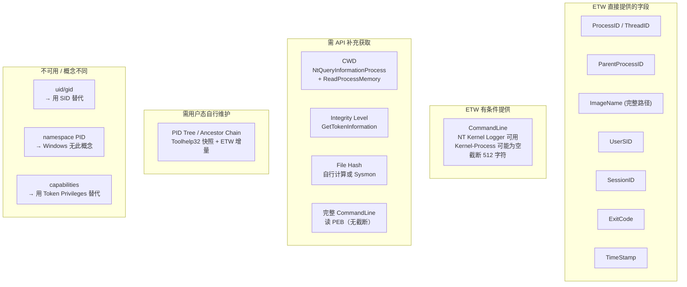

# Windows HIDS 开发背景调研：面向 Linux eBPF 开发者的 Windows 对照手册

## 面向 Linux 内核开发者的 Windows 安全采集能力评估

Posted by pandaychen on March 24, 2026

---

## 0x00 Windows 进程/线程机制 vs Linux 全面对比

本章从内核数据结构、进程创建/销毁流程、进程树、线程模型、ID 体系等维度，对 Windows 和 Linux 做全面对照。目标是让熟悉 Linux task_struct / eBPF 的开发者快速建立 Windows 侧的心智模型。

### 内核数据结构对比

```
Linux 侧:                              Windows 侧:
┌──────────────────┐                    ┌──────────────────────────────────┐
│   task_struct     │                    │          EPROCESS                │
│  ┌──────────────┐│                    │  ┌──────────────────────────┐   │
│  │ pid/tgid     ││                    │  │ KPROCESS (调度/内核态)    │   │
│  │ comm[16]     ││                    │  │  ├── DirectoryTableBase  │   │
│  │ *mm (内存)   ││                    │  │  ├── ThreadListHead      │   │
│  │ *fs (文件系统)││                    │  │  └── Affinity/Priority   │   │
│  │ *files       ││                    │  ├──────────────────────────┤   │
│  │ *cred (权限) ││                    │  │ UniqueProcessId (PID)    │   │
│  │ parent       ││                    │  │ InheritedFromUniqueProcessId│ │
│  │ children     ││                    │  │ Token (安全令牌, ~= cred)│   │
│  │ sibling      ││                    │  │ ImageFileName[15]        │   │
│  └──────────────┘│                    │  │ Peb (用户态 PEB 指针)    │   │
│                   │                    │  │ ActiveProcessLinks (双链)│   │
│ 进程=线程=task    │                    │  │ ObjectTable (句柄表)     │   │
│ (clone flags 区分)│                    │  │ VadRoot (虚拟地址描述符) │   │
└──────────────────┘                    │  └──────────────────────────┘   │
                                        └──────────────────────────────────┘
线程 task_struct:                        ┌──────────────────────────────────┐
  与进程共用同一结构                      │          ETHREAD                 │
  thread_group 链表关联                   │  ┌──────────────────────────┐   │
  clone(CLONE_VM|CLONE_FS|...)           │  │ KTHREAD (调度/内核态)    │   │
                                        │  │  ├── StackBase/Limit     │   │
                                        │  │  ├── StartAddress        │   │
                                        │  │  └── ApcState            │   │
                                        │  ├──────────────────────────┤   │
                                        │  │ Cid.UniqueThread (TID)   │   │
                                        │  │ ThreadsProcess -> EPROCESS│  │
                                        │  │ Win32StartAddress        │   │
                                        │  │ Teb (用户态 TEB 指针)    │   │
                                        │  └──────────────────────────┘   │
                                        └──────────────────────────────────┘
```

#### 核心结构对照表

| 维度 | Linux | Windows | 关键差异 |
|------|-------|---------|---------|
| 进程内核对象 | `task_struct` | `EPROCESS`（含嵌套的 `KPROCESS`） | Linux 用单一结构体表示进程和线程；Windows 分 Executive 层（EPROCESS）和 Kernel 层（KPROCESS）两级 |
| 线程内核对象 | `task_struct`（`CLONE_VM` 共享地址空间） | `ETHREAD`（含嵌套的 `KTHREAD`） | Linux 内核不区分进程/线程，Windows 有独立的线程对象 |
| 用户态进程信息块 | `/proc/[pid]/` 伪文件系统 | PEB（Process Environment Block） | Linux 通过 VFS 暴露；Windows 通过内核指针访问 PEB 结构体 |
| 用户态线程信息块 | 无专用结构（pthread 内部 TCB） | TEB（Thread Environment Block） | TEB 通过 `fs:`（x86）/ `gs:`（x64）段寄存器直接寻址 |
| 进程列表 | `init_task` 双向链表 + 进程树 | `PsActiveProcessHead` 双向链表（`EPROCESS.ActiveProcessLinks`） | 两者都是内核双向链表；但 Linux 有 parent/children/sibling 树形结构，Windows 仅有平坦链表 |
| 命名空间隔离 | PID/Network/Mount/... namespaces | Job Object（部分类似）/ Session | Linux namespace 远比 Windows 灵活；Windows 通过 Session + Job 实现有限隔离 |

### 进程创建与销毁

#### Linux: fork/exec 模型

```
fork() / clone()
  └── copy_process()
        ├── dup_task_struct()      // 复制 task_struct
        ├── copy_mm()              // 复制/共享内存描述符
        ├── copy_files()           // 复制/共享文件描述符表
        ├── copy_fs()              // 复制/共享 fs_struct
        ├── copy_creds()           // 复制凭证
        └── sched_fork()           // 初始化调度实体

execve()
  └── do_execveat_common()
        ├── bprm_execve()          // 加载新映像
        ├── flush_old_exec()       // 清理旧地址空间
        └── install_exec_creds()   // 安装新凭证
```

- fork 创建一个几乎完全复制的子进程（COW 优化）
- exec 替换当前进程映像，PID 不变
- **进程树是天然结构**：`task_struct.parent` 指向父进程，`task_struct.children` 链表指向所有子进程

#### Windows: CreateProcess 模型

```
CreateProcessW()
  └── NtCreateUserProcess() [ntdll → 内核]
        ├── PspAllocateProcess()        // 分配 EPROCESS
        │     ├── ObCreateObject()      // 创建进程对象
        │     ├── MmCreateProcessAddressSpace()  // 创建地址空间
        │     └── PspSetupProcessEnvironment()   // 创建 PEB
        ├── PspAllocateThread()         // 分配初始线程 ETHREAD
        │     ├── ObCreateObject()      // 创建线程对象
        │     └── KeInitThread()        // 初始化 KTHREAD
        ├── PspInsertProcess()          // 插入进程链表
        │     └── 设置 InheritedFromUniqueProcessId = 调用者 PID
        └── PspInsertThread()           // 插入线程链表，线程开始执行
```

**关键差异**：
- Windows **没有 fork**。`CreateProcess` 是一步完成"创建新进程 + 加载映像 + 创建初始线程"
- Windows 中进程本身不可执行，**线程才是调度和执行的基本单位**。一个进程至少有一个线程
- 不存在 exec 语义（用新映像替换当前进程）

### 进程树（PID Tree）

这是从 Linux 迁移到 Windows 时最大的认知差异之一。

#### Linux 的天然进程树

```c
struct task_struct {
    struct task_struct *parent;       // 父进程指针
    struct list_head children;        // 子进程链表头
    struct list_head sibling;         // 兄弟进程链表节点
    struct task_struct *group_leader; // 线程组 leader
};
```

- 内核维护了完整的树形结构，`parent` 指针永远有效（孤儿进程被 init/subreaper 收养）
- `pstree` 命令直接遍历内核树
- PPID 始终指向活着的祖先进程

#### Windows 的"伪进程树"

```c
typedef struct _EPROCESS {
    HANDLE InheritedFromUniqueProcessId;  // 创建者的 PID（仅此一个字段）
    // 没有 children 链表
    // 没有 sibling 链表
    // 没有 parent 指针（严格说 InheritedFrom 就是，但不维护树结构）
};
```

**Windows 进程树的关键问题**：

1. **无内核级树结构**：Windows 内核只记录了 `InheritedFromUniqueProcessId`（创建者 PID），没有 children/sibling 链表。不存在内核 API 可以"遍历某进程的所有子进程"

2. **PID 复用问题**：Windows 的 PID 是从一个 Handle Table 分配的，进程退出后 PID 可以被新进程复用。如果父进程先退出，`InheritedFromUniqueProcessId` 仍保留旧值，但该 PID 可能已被完全不相关的进程占用

3. **父进程退出后 PPID 不更新**：与 Linux 不同（孤儿进程被 init 收养，PPID 变为 1），Windows 中父进程退出后子进程的 `InheritedFromUniqueProcessId` 不变，指向一个已不存在或已被复用的 PID

4. **必须在用户态自行维护进程树**：HIDS 必须通过以下方式构建进程树：
   - 启动时用 `CreateToolhelp32Snapshot` 快照当前所有进程
   - 运行时通过 ETW 进程创建/退出事件增量更新
   - 自行实现 `GetAncestorChain` 逻辑回溯祖先链

这正是我们 PoC 代码中 `ProcessTree` 结构体的设计原因：

```go
// 用户态进程树维护 — Windows 内核不提供此能力
type ProcessTree struct {
    mu    sync.RWMutex
    procs map[uint32]*ProcessInfo  // PID -> ProcessInfo
}

func (pt *ProcessTree) GetAncestorChain(pid uint32, maxDepth int) []*ProcessChainNode {
    // 从当前 PID 沿 PPID 回溯，构建祖先链
    // 需要处理: PID 复用、祖先已退出（保留延迟清理）、循环检测
}
```

### 线程模型对比

| 维度 | Linux | Windows |
|------|-------|---------|
| 内核抽象 | 线程 = `task_struct`（`CLONE_VM` 标志） | 线程 = `ETHREAD`，独立于进程的内核对象 |
| 调度单位 | `task_struct` | `KTHREAD`（ETHREAD 内嵌） |
| 创建 API | `clone()` / `pthread_create()` | `CreateThread()` / `NtCreateThreadEx()` |
| TID 分配 | 与 PID 共用 `alloc_pid()` | 与 PID 共用 Handle Table（PID 和 TID 在同一命名空间，不会冲突） |
| 纤程/协程 | 无内核支持（用户态 ucontext/goroutine） | Fiber（`CreateFiber`，用户态调度，共享 TEB） |
| 线程本地存储 | `__thread` / `pthread_key_t` | TEB + `TlsAlloc()` / `__declspec(thread)` |
| 线程组 | `thread_group` 链表（共享 tgid） | `EPROCESS.ThreadListHead` 链表 |

**关键差异**：Linux 的"一切皆 task_struct"模型意味着 eBPF 程序可以用统一的 hook 同时捕获进程和线程事件（只需检查 `tgid == pid`）。Windows 中进程和线程是完全不同的内核对象类型，ETW 分别用不同的 EventID 报告（EID 1/2 = 进程创建/退出，EID 3/4 = 线程创建/退出）。

### ID 体系对比

| ID 类型 | Linux | Windows | 说明 |
|---------|-------|---------|------|
| **进程 ID** | `pid_t pid`（通常 ≤ 32768，可调大） | `DWORD ProcessId`（4 的倍数，最大取决于系统配置） | Linux PID 连续分配后回绕；Windows 从 Handle Table 分配，4 的倍数，可更快复用 |
| **线程 ID** | `pid_t tid`（与 PID 同一命名空间） | `DWORD ThreadId`（与 PID 同一命名空间，不冲突） | 两者都保证 PID/TID 全局唯一且不冲突 |
| **进程组** | `pid_t pgid`（`setpgrp()`） | Job Object（功能类似但更强大） | Linux 进程组用于信号分发和终端控制 |
| **会话** | `pid_t sid`（`setsid()`） | Session ID（登录会话，0=SYSTEM） | Windows Session 与远程桌面/终端服务紧密绑定 |
| **用户身份** | `uid_t uid` / `gid_t gid` | SID（安全标识符，如 `S-1-5-21-...-1001`） | **本质差异**：Linux 用数字 uid/gid；Windows 用变长 SID 结构 |
| **权限** | `capability_t` 位掩码 | Token + ACL + Integrity Level | Windows 的权限模型基于 Access Token，包含 SID 列表 + 特权列表 + 完整性级别 |
| **命名空间 PID** | `pid_nr_ns()`（ns_pid） | 无等价物 | Windows 没有 PID namespace 概念 |

#### Windows SID vs Linux uid

```
Linux uid:   整数，如 1000
             直接查 /etc/passwd 得到用户名

Windows SID: S-1-5-21-3623811015-3361044348-30300820-1013
             结构: S-{revision}-{authority}-{sub1}-{sub2}-{sub3}-{RID}
             └── 域/机器 SID = S-1-5-21-3623811015-3361044348-30300820
             └── 用户 RID = 1013
             需要 LookupAccountSid() 转为 "DOMAIN\Username"

常见 Well-known SID:
  S-1-5-18          = NT AUTHORITY\SYSTEM  (类似 Linux root/uid=0)
  S-1-5-19          = NT AUTHORITY\LOCAL SERVICE
  S-1-5-20          = NT AUTHORITY\NETWORK SERVICE
  S-1-5-32-544      = BUILTIN\Administrators
```

### 进程环境信息获取方式对比

| 信息 | Linux 获取方式 | Windows 获取方式 |
|------|---------------|-----------------|
| 进程列表 | 遍历 `/proc/[pid]/` | `CreateToolhelp32Snapshot` + `Process32First/Next` 或 `NtQuerySystemInformation(SystemProcessInformation)` |
| 命令行 | `/proc/[pid]/cmdline` | 读取目标进程 PEB->ProcessParameters->CommandLine（需 `ReadProcessMemory`）或 WMI `Win32_Process.CommandLine` |
| 可执行文件路径 | `/proc/[pid]/exe`（符号链接） | `QueryFullProcessImageNameW()` 或 `GetProcessImageFileNameW()` |
| 当前工作目录 | `/proc/[pid]/cwd`（符号链接） | 读取 PEB->ProcessParameters->CurrentDirectory（需 `NtQueryInformationProcess` + `ReadProcessMemory`） |
| 环境变量 | `/proc/[pid]/environ` | 读取 PEB->ProcessParameters->Environment（需 `ReadProcessMemory`） |
| 打开的文件 | `/proc/[pid]/fd/` | `NtQuerySystemInformation(SystemHandleInformation)` + `NtDuplicateObject` |
| 内存映射 | `/proc/[pid]/maps` | `VirtualQueryEx()` 遍历 VAD 树 |
| 线程列表 | `/proc/[pid]/task/` | `CreateToolhelp32Snapshot(TH32CS_SNAPTHREAD)` + `Thread32First/Next` |

**关键认知**：Linux 的 `/proc` 是一个强大的内核信息暴露机制，几乎所有进程信息都通过文件系统接口可读。Windows 没有等价机制，获取远程进程信息需要调用各种 Win32/NT API，很多需要相应的进程句柄权限（`PROCESS_QUERY_INFORMATION`、`PROCESS_VM_READ`）。

## 0x01 ETW 文件事件详解

### Provider 信息

```
Provider:  Microsoft-Windows-Kernel-File
GUID:      {EDD08927-9CC4-4E65-B970-C2560FB5C289}
```

### 可用 Keyword 过滤

| Keyword | 值 | 用途 |
|---------|-----|------|
| KERNEL_FILE_KEYWORD_FILENAME | 0x10 | 文件名创建/删除事件 |
| KERNEL_FILE_KEYWORD_FILEIO | 0x20 | 文件 I/O 操作事件 |
| KERNEL_FILE_KEYWORD_OP_END | 0x40 | I/O 操作完成事件 |
| KERNEL_FILE_KEYWORD_CREATE | 0x80 | 文件打开/创建事件 |
| KERNEL_FILE_KEYWORD_READ | 0x100 | 文件读取事件 |
| KERNEL_FILE_KEYWORD_WRITE | 0x200 | 文件写入事件 |
| KERNEL_FILE_KEYWORD_DELETE_PATH | 0x400 | 文件路径删除事件 |
| KERNEL_FILE_KEYWORD_RENAME_SETLINK_PATH | 0x800 | 重命名/硬链接事件 |

### 完整 EventID 列表及字段

#### EID 10: NameCreate（文件名对象创建）

当内核创建一个新的文件名对象时触发。注意这不等同于"创建了一个新文件"，而是内核为某个路径创建了名称追踪条目。

| 字段 | 类型 | 含义 |
|------|------|------|
| FileObject | Pointer | 文件对象的内核地址 |
| FileName | UnicodeString | 文件的完整路径（NT 格式，如 `\Device\HarddiskVolume3\Users\...`） |

#### EID 11: NameDelete（文件名对象删除）

文件名对象被销毁时触发。

| 字段 | 类型 | 含义 |
|------|------|------|
| FileObject | Pointer | 文件对象的内核地址 |
| FileName | UnicodeString | 文件路径 |

#### EID 12: Create（文件打开/创建操作 — `CreateFile` 调用）

最重要的文件事件之一。每次调用 `CreateFile`/`NtCreateFile` 时触发，无论文件是新建还是打开已有文件。

| 字段 | 类型 | 含义 |
|------|------|------|
| IrpPtr | Pointer | I/O 请求包（IRP）地址，用于关联 OperationEnd |
| FileObject | Pointer | 文件对象内核地址 |
| TTID | UInt32 | 发起操作的线程 ID（可据此关联进程） |
| CreateOptions | UInt32 | 创建/打开选项（对应 `NtCreateFile` 的 CreateOptions 参数：FILE_DIRECTORY_FILE=0x1, FILE_WRITE_THROUGH=0x2, FILE_SEQUENTIAL_ONLY=0x8, FILE_NO_INTERMEDIATE_BUFFERING=0x8, FILE_SYNCHRONOUS_IO_NONALERT=0x20 等） |
| FileAttributes | UInt32 | 文件属性（FILE_ATTRIBUTE_READONLY=0x1, HIDDEN=0x2, SYSTEM=0x4, DIRECTORY=0x10, ARCHIVE=0x20, NORMAL=0x80 等） |
| ShareAccess | UInt32 | 共享访问模式（FILE_SHARE_READ=0x1, FILE_SHARE_WRITE=0x2, FILE_SHARE_DELETE=0x4） |
| OpenPath | UnicodeString | 文件打开路径 |

#### EID 13: Cleanup（文件清理）

最后一个用户态句柄关闭时触发（IRP_MJ_CLEANUP）。

| 字段 | 类型 | 含义 |
|------|------|------|
| IrpPtr | Pointer | IRP 地址 |
| FileObject | Pointer | 文件对象地址 |
| FileKey | Pointer | 文件唯一标识 |
| TTID | UInt32 | 线程 ID |

#### EID 14: Close（文件对象关闭）

文件对象的最后一个引用释放时触发（IRP_MJ_CLOSE）。

| 字段 | 类型 | 含义 |
|------|------|------|
| IrpPtr | Pointer | IRP 地址 |
| FileObject | Pointer | 文件对象地址 |
| FileKey | Pointer | 文件唯一标识 |
| TTID | UInt32 | 线程 ID |

#### EID 15: Read（文件读取）

| 字段 | 类型 | 含义 |
|------|------|------|
| IrpPtr | Pointer | IRP 地址 |
| FileObject | Pointer | 文件对象地址 |
| FileKey | Pointer | 文件唯一标识 |
| TTID | UInt32 | 线程 ID |
| Offset | UInt64 | 读取偏移量（字节） |
| IoSize | UInt32 | 请求读取的字节数 |
| IoFlags | UInt32 | I/O 标志 |

#### EID 16: Write（文件写入）

字段与 Read 完全一致，仅语义不同（写入而非读取）。

| 字段 | 类型 | 含义 |
|------|------|------|
| IrpPtr | Pointer | IRP 地址 |
| FileObject | Pointer | 文件对象地址 |
| FileKey | Pointer | 文件唯一标识 |
| TTID | UInt32 | 线程 ID |
| Offset | UInt64 | 写入偏移量 |
| IoSize | UInt32 | 请求写入的字节数 |
| IoFlags | UInt32 | I/O 标志 |

#### EID 17: SetInformation（设置文件信息）

修改文件属性/元数据（`SetFileInformationByHandle`）。

| 字段 | 类型 | 含义 |
|------|------|------|
| IrpPtr | Pointer | IRP 地址 |
| FileObject | Pointer | 文件对象地址 |
| FileKey | Pointer | 文件唯一标识 |
| TTID | UInt32 | 线程 ID |
| InfoClass | UInt32 | 设置的信息类别（FileBasicInformation=4, FileRenameInformation=10, FileDispositionInformation=13 等） |
| ExtraInformation | UInt32 | 附加信息 |

#### EID 18: SetDelete（标记文件删除）

调用 `DeleteFile` 时实际触发的是 `SetFileInformationByHandle(FileDispositionInformation)`，此事件对应标记文件为待删除状态。

| 字段 | 类型 | 含义 |
|------|------|------|
| IrpPtr | Pointer | IRP 地址 |
| FileObject | Pointer | 文件对象地址 |
| FileKey | Pointer | 文件唯一标识 |
| TTID | UInt32 | 线程 ID |

#### EID 19: Rename（文件重命名）

| 字段 | 类型 | 含义 |
|------|------|------|
| IrpPtr | Pointer | IRP 地址 |
| FileObject | Pointer | 文件对象地址 |
| FileKey | Pointer | 文件唯一标识 |
| TTID | UInt32 | 线程 ID |
| ExtraInformation | UInt32 | 附加信息 |

#### EID 20: DirEnum（目录枚举）

`FindFirstFile`/`FindNextFile` 调用时触发。

| 字段 | 类型 | 含义 |
|------|------|------|
| IrpPtr | Pointer | IRP 地址 |
| FileObject | Pointer | 文件对象地址 |
| FileKey | Pointer | 文件唯一标识 |
| TTID | UInt32 | 线程 ID |
| InfoClass | UInt32 | 目录枚举信息类别 |
| FileName | UnicodeString | 搜索的文件名模式 |

#### EID 21: Flush（文件刷盘）

`FlushFileBuffers` 调用。字段与 Cleanup 类似。

#### EID 22: QueryInformation（查询文件信息）

`GetFileInformationByHandle` 等调用。字段包含 InfoClass 标识查询的信息类别。

#### EID 23: FSCTL（文件系统控制）

`DeviceIoControl` 调用文件系统控制操作。

#### EID 24: OperationEnd（I/O 操作完成）

异步 I/O 的完成通知。通过 IrpPtr 与起始事件关联。

| 字段 | 类型 | 含义 |
|------|------|------|
| IrpPtr | Pointer | 与起始事件配对的 IRP 地址 |
| FileObject | Pointer | 文件对象地址 |
| ExtraInformation | Pointer | 操作结果（通常是 NTSTATUS） |
| NtStatus | UInt32 | 操作的 NT 状态码（0 = 成功） |

#### EID 25: DirNotify（目录变更通知）

`ReadDirectoryChangesW` 注册的目录变更通知触发。

#### EID 26: DeletePath（路径删除）

直接通过路径删除文件（如 `NtDeleteFile`）。

| 字段 | 类型 | 含义 |
|------|------|------|
| IrpPtr | Pointer | IRP 地址 |
| FileObject | Pointer | 文件对象地址 |
| FileKey | Pointer | 文件唯一标识 |
| TTID | UInt32 | 线程 ID |
| ExtraInformation | UInt32 | 附加信息 |
| FileName | UnicodeString | 被删除文件的路径 |

#### EID 27: RenamePath（路径重命名）

类似 DeletePath，通过路径重命名。字段包含 FileName。

#### EID 28: SetLinkPath（设置硬链接）

创建硬链接时触发。字段包含 FileName。

#### EID 30: CreateNewFile（创建新文件）

当 `NtCreateFile` 的 CreateDisposition 为 FILE_CREATE（仅新建，文件不存在时创建）时触发。这是真正的"新文件创建"事件。

| 字段 | 类型 | 含义 |
|------|------|------|
| IrpPtr | Pointer | IRP 地址 |
| FileObject | Pointer | 文件对象地址 |
| TTID | UInt32 | 线程 ID |
| CreateOptions | UInt32 | 创建选项 |
| FileAttributes | UInt32 | 文件属性 |
| ShareAccess | UInt32 | 共享访问模式 |
| OpenPath | UnicodeString | 新文件路径 |

### 与 Linux 文件监控机制对比

| 维度 | Linux (fanotify/inotify/eBPF) | Windows ETW Kernel-File |
|------|-------------------------------|------------------------|
| **新文件创建** | `FAN_CREATE` / `IN_CREATE` / `tracepoint:syscalls:sys_enter_openat` | EID 30 CreateNewFile |
| **文件打开** | `FAN_OPEN` / `tracepoint:syscalls:sys_enter_openat` | EID 12 Create |
| **文件读取** | `FAN_ACCESS` / `IN_ACCESS` / kprobe vfs_read | EID 15 Read |
| **文件写入** | `FAN_MODIFY` / `IN_MODIFY` / kprobe vfs_write | EID 16 Write |
| **文件删除** | `FAN_DELETE` / `IN_DELETE` / tracepoint | EID 18 SetDelete / EID 26 DeletePath |
| **文件重命名** | `FAN_MOVED_FROM`+`FAN_MOVED_TO` / `IN_MOVED_*` | EID 19 Rename / EID 27 RenamePath |
| **文件属性修改** | `IN_ATTRIB` | EID 17 SetInformation |
| **获取操作者 PID** | fanotify 的 `struct fanotify_event_metadata.pid` | 通过 TTID（线程 ID）反查进程树 |
| **获取文件内容** | fanotify `FAN_OPEN_PERM` 可拿到 fd 读内容 | **不可行** — ETW 只报告元数据 |
| **性能特点** | fanotify 有 permission 事件（同步阻塞）；eBPF 近零开销 | 异步非阻塞；高频事件（Read/Write 每秒数万）需过滤 |
| **路径格式** | POSIX 路径（`/home/user/file.txt`） | NT 内核路径（`\Device\HarddiskVolume3\Users\...`），需手动转为 Win32 路径 |

**关键注意**：ETW Kernel-File 事件通过 `TTID`（线程 ID）标识操作发起者，而不是直接给出 PID。需要在事件 Header 中取 ProcessID 或者通过线程 ID 反查进程。另外文件路径是 NT 内核格式，HIDS 需要做 NT → Win32 路径转换（参见 PoC 代码中的 `ntPathToWin32` 函数）。

## 0x02 ETW 内存事件详解

Windows 内存事件的 ETW 采集能力分为两层：标准层（任何管理员进程可用）和高级层（需要 PPL 保护进程）。

### 标准层：NT Kernel Logger 的虚拟内存事件

```
Provider:  NT Kernel Logger（系统 trace session）
GUID:      {9E814AAD-3204-11D2-9A82-006008A86939}
关联类:    PageFault_VirtualAlloc
```

#### EID 98: VirtualAlloc（虚拟内存分配）

每次调用 `VirtualAlloc` / `VirtualAllocEx` / `NtAllocateVirtualMemory` 时触发。

| 字段 | 类型 | 含义 |
|------|------|------|
| BaseAddress | Pointer | 分配的内存起始地址 |
| RegionSize | Pointer (SizeT) | 分配的内存大小（字节） |
| ProcessId | UInt32 | 目标进程 PID（`VirtualAllocEx` 可分配到远程进程） |
| Flags | UInt32 | 分配类型标志（`MEM_COMMIT=0x1000`, `MEM_RESERVE=0x2000`, `MEM_RESET=0x80000`） |

#### EID 99: VirtualFree（虚拟内存释放）

每次调用 `VirtualFree` / `VirtualFreeEx` / `NtFreeVirtualMemory` 时触发。

| 字段 | 类型 | 含义 |
|------|------|------|
| BaseAddress | Pointer | 释放的内存起始地址 |
| RegionSize | Pointer (SizeT) | 释放的内存大小 |
| ProcessId | UInt32 | 目标进程 PID |
| Flags | UInt32 | 释放类型（`MEM_DECOMMIT=0x4000`, `MEM_RELEASE=0x8000`） |

**标准层的局限**：

- **没有 VirtualProtect 事件**：无法监控内存保护属性变更（如 RW → RX，这是 shellcode 注入的关键步骤）
- **没有内存保护标志**：VirtualAlloc 事件的 Flags 字段只包含分配类型，不包含保护属性（PAGE_EXECUTE_READWRITE 等）
- **没有 MapViewOfFile 事件**：无法监控文件映射到内存的操作
- **没有跨进程内存操作事件**：`WriteProcessMemory` / `ReadProcessMemory` 不产生 ETW 事件

### 高级层：Microsoft-Windows-Threat-Intelligence Provider

```
Provider:  Microsoft-Windows-Threat-Intelligence
GUID:      {F4E1897C-BB5D-5668-F1D8-040F4D8DD344}
要求:      消费者进程必须是 PPL (Protected Process Light) 级别
           具体要求: Anti-Malware PPL 或更高
```

这个 Provider 是微软为 EDR/杀毒软件设计的特权 ETW 源，提供了标准层缺失的关键内存操作事件。

#### 可用事件类型

| 事件 | 关键字 | 含义 | 安全检测价值 |
|------|--------|------|------------|
| **ALLOCVM_REMOTE** | 0x1 | 远程进程内存分配 | 检测远程进程注入的第一步 |
| **ALLOCVM_LOCAL** | 0x2 | 本地进程内存分配 | - |
| **PROTECTVM_REMOTE** | 0x4 | 远程进程内存保护修改 | 检测 RW→RX 转换（shellcode 注入关键步骤） |
| **PROTECTVM_LOCAL** | 0x8 | 本地进程内存保护修改 | 检测 ETW patching、自修改代码 |
| **MAPVIEW_REMOTE** | 0x10 | 远程进程内存映射 | 检测 DLL 注入 |
| **MAPVIEW_LOCAL** | 0x20 | 本地进程内存映射 | - |
| **QUEUEUSERAPC_REMOTE** | 0x100 | 远程 APC 注入 | 检测 APC 注入攻击 |
| **SETTHREADCONTEXT_REMOTE** | 0x400 | 修改远程线程上下文 | 检测线程劫持 |
| **READVM_LOCAL** / **READVM_REMOTE** | - | 读取进程内存 | 默认 Windows 不生成此事件 |
| **WRITEVM_LOCAL** / **WRITEVM_REMOTE** | - | 写入进程内存 | 默认 Windows 不生成此事件 |

**PPL 要求意味着什么**：

```
普通管理员进程（如你的 HIDS Agent）：
  → 无法订阅 Threat-Intelligence Provider
  → 只能使用标准层的 VirtualAlloc/VirtualFree 事件

要订阅 Threat-Intelligence Provider，你的进程需要：
  方案 A: 签名为 Anti-Malware PPL（需要微软 ELAM 签名，个人/小团队几乎无法获得）
  方案 B: 使用内核驱动绕过 PPL 检查（需要 EV 代码签名证书 + WHQL 驱动签名）
  方案 C: 利用未文档化的 SecurityTrace ETW 标志（存在兼容性风险）
```

**结论**：对于我们的纯用户态 HIDS 方案，Threat-Intelligence Provider 在 Phase 1 **不可用**。这是 Windows 与 Linux 在内存监控能力上的巨大差距——Linux eBPF 可以 hook 任何内核函数（如 `mmap`/`mprotect`/`process_vm_writev`）而无需特殊签名。

### 与 Linux 内存监控对比

| 能力 | Linux (eBPF) | Windows ETW 标准层 | Windows ETW Threat-Intelligence |
|------|-------------|-------------------|-------------------------------|
| VirtualAlloc / mmap | `tracepoint:syscalls:sys_enter_mmap` | EID 98 VirtualAlloc | ALLOCVM |
| VirtualFree / munmap | `tracepoint:syscalls:sys_enter_munmap` | EID 99 VirtualFree | - |
| mprotect / VirtualProtect | `tracepoint:syscalls:sys_enter_mprotect` | **不可用** | PROTECTVM（需 PPL） |
| process_vm_writev / WriteProcessMemory | kprobe `process_vm_rw_core` | **不可用** | WRITEVM（需 PPL，默认不生成） |
| 文件映射 mmap MAP_SHARED | `tracepoint:syscalls:sys_enter_mmap` | **不可用** | MAPVIEW（需 PPL） |
| brk (堆扩展) | `tracepoint:syscalls:sys_enter_brk` | **不可用** | **不可用** |
| 页面错误 | `tracepoint:exceptions:page_fault_*` | NT Kernel Logger PageFault 事件 | - |
| 获取保护属性 | 从 mprotect 参数直接获取 | **不可用** | PROTECTVM 事件包含旧/新保护属性 |

## 0x03 ETW 网络事件详解

### TCP 事件：Microsoft-Windows-Kernel-Network

```
Provider:  Microsoft-Windows-Kernel-Network
GUID:      {7DD42A49-5329-4832-8DFD-43D979153A88}
```

#### TCP 事件 ID 分类

| 操作 | IPv4 EID | IPv6 EID | 类别 |
|------|----------|----------|------|
| **Send（数据发送）** | 10 | 26 | TcpIp_TypeGroup1 / TcpIp_TypeGroup3 |
| **Receive（数据接收）** | 11 | 27 | TcpIp_TypeGroup1 / TcpIp_TypeGroup3 |
| **Connect（主动连接 — 对标 Linux connect()）** | 12 | 28 | TcpIp_TypeGroup2 / TcpIp_TypeGroup4 |
| **Disconnect（断开连接）** | 13 | 29 | TcpIp_TypeGroup1 / TcpIp_TypeGroup3 |
| **Retransmit（重传）** | 14 | 30 | TcpIp_TypeGroup1 / TcpIp_TypeGroup3 |
| **Accept（被动接受 — 对标 Linux accept()）** | 15 | 31 | TcpIp_TypeGroup2 / TcpIp_TypeGroup4 |
| **Reconnect（重连尝试）** | 16 | 32 | TcpIp_TypeGroup1 / TcpIp_TypeGroup3 |
| **TCPCopy** | 18 | 34 | - |

#### Connect / Accept 事件字段（IPv4 — TcpIp_TypeGroup2）

这两个是 HIDS 最关心的网络事件，分别对应出站连接和入站连接。

| 字段 | 类型 | 含义 | HIDS 用途 |
|------|------|------|----------|
| **PID** | UInt32 | 发起连接/接受连接的进程 PID | 关联到进程树 |
| **size** | UInt32 | 数据包大小 | - |
| **daddr** | IPv4Address | 目标 IP 地址 | Connect: 对方 IP；Accept: 客户端 IP |
| **saddr** | IPv4Address | 源 IP 地址 | Connect: 本机 IP；Accept: 本机监听 IP |
| **dport** | Port (UInt16) | 目标端口 | Connect: 对方端口；Accept: 本机监听端口 |
| **sport** | Port (UInt16) | 源端口 | Connect: 本机随机端口；Accept: 客户端端口 |
| **mss** | UInt16 | 最大段大小 | - |
| **sackopt** | UInt16 | SACK 选项 | - |
| **tsopt** | UInt16 | 时间戳选项 | - |
| **wsopt** | UInt16 | 窗口缩放选项 | - |
| **rcvwin** | UInt32 | 接收窗口大小 | - |
| **rcvwinscale** | SInt16 | 接收窗口缩放因子 | - |
| **sndwinscale** | SInt16 | 发送窗口缩放因子 | - |
| **seqnum** | UInt32 | 序列号 | - |
| **connid** | UInt32 | 连接唯一标识 | 用于关联同一连接的后续事件 |

Connect/Accept 的 IPv6 变体（TcpIp_TypeGroup4）字段完全相同，仅 `saddr`/`daddr` 类型为 IPv6Address。

#### Send / Receive 事件字段（TcpIp_TypeGroup1）

| 字段 | 类型 | 含义 |
|------|------|------|
| PID | UInt32 | 进程 PID |
| size | UInt32 | 传输数据大小（字节） |
| daddr | IPv4Address | 目标 IP |
| saddr | IPv4Address | 源 IP |
| dport | Port | 目标端口 |
| sport | Port | 源端口 |
| connid | UInt32 | 连接标识 |
| seqnum | UInt32 | 序列号 |
| startime | UInt32 | 起始时间 |
| endtime | UInt32 | 结束时间 |

#### Connect vs Accept — 从 HIDS 视角

```
Connect (EID 12/28) — 主动出站连接:
  场景: 进程主动连接远程服务器
  检测: C2 通信、数据外泄、矿池连接
  关键字段: PID + daddr + dport

Accept (EID 15/31) — 被动入站连接:
  场景: 进程监听端口并接受外部连接
  检测: 反弹 shell、未授权服务、横向移动
  关键字段: PID + saddr + sport（客户端来源）
```

### UDP 事件

| 操作 | EID | 类别 |
|------|-----|------|
| DataSentOverUDPProtocol | 42 | UDP 发送 |
| DataReceivedOverUDPProtocol | 43 | UDP 接收 |

UDP 事件字段与 TCP Send/Receive 类似：PID, size, daddr, saddr, dport, sport, connid。

### DNS 事件：Microsoft-Windows-DNS-Client

```
Provider:  Microsoft-Windows-DNS-Client
GUID:      {1C95126E-7EEA-49A9-A3FE-A378B03DDB4D}
```

#### EID 3008: QueryInitiated（DNS 查询发起）

| 字段 | 类型 | 含义 |
|------|------|------|
| QueryName | UnicodeString | 查询的域名（如 `evil.example.com`） |
| QueryType | UInt32 | DNS 记录类型（1=A, 28=AAAA, 5=CNAME, 15=MX, 16=TXT, 33=SRV, 65=HTTPS, 255=ANY） |

注意：QueryInitiated 事件本身不包含 ProcessID 字段，但 **ETW Event Header 中包含 ProcessID**，可以据此关联到发起 DNS 查询的进程。

#### EID 3006: QueryCompleted（DNS 查询完成）

| 字段 | 类型 | 含义 |
|------|------|------|
| QueryName | UnicodeString | 查询的域名 |
| QueryType | UInt32 | DNS 记录类型 |
| QueryStatus | UInt32 | 查询状态（0=成功, 9003=NXDOMAIN, 9501=DNS_ERROR_RCODE_TIMEOUT 等） |
| QueryResults | UnicodeString | 查询结果（多个结果以分号分隔，如 `93.184.216.34;2606:2800:220:1:248:1893:25c8:1946`） |

### 与 Linux 网络监控对比

| 能力 | Linux (eBPF) | Windows ETW |
|------|-------------|-------------|
| **TCP Connect** | kprobe `tcp_v4_connect` / tracepoint `inet_sock_set_state` | EID 12/28 (Connect) |
| **TCP Accept** | kprobe `inet_csk_accept` / tracepoint `inet_sock_set_state` | EID 15/31 (Accept) |
| **TCP Send** | kprobe `tcp_sendmsg` | EID 10/26 (Send) |
| **TCP Recv** | kprobe `tcp_recvmsg` | EID 11/27 (Receive) |
| **TCP Close** | kprobe `tcp_close` | EID 13/29 (Disconnect) |
| **UDP Send** | kprobe `udp_sendmsg` | EID 42 (DataSentOverUDP) |
| **UDP Recv** | kprobe `udp_recvmsg` | EID 43 (DataReceivedOverUDP) |
| **DNS 查询** | 需要自行解析 UDP 53 payload | DNS-Client EID 3006/3008（**内建解析，直接给域名**） |
| **获取 PID** | BPF helper `bpf_get_current_pid_tgid()` | 事件字段 PID 或 Event Header ProcessID |
| **获取 comm** | BPF helper `bpf_get_current_comm()` | 需通过 PID 反查进程树 |
| **获取完整命令行** | 需额外 hook execve | 需通过 PID 反查进程树（ETW 网络事件不含命令行） |
| **流量内容** | XDP/TC 可获取完整数据包 | **不可用** — ETW 只提供连接元数据 |
| **包过滤/拦截** | XDP/TC 可丢弃/修改数据包 | **不可用** — ETW 只是观测，不能拦截（需 WFP） |

**Windows 的 DNS 采集优势**：Linux eBPF 要采集 DNS 需要自行解析 UDP payload（或 hook `getaddrinfo`），而 Windows 的 DNS-Client ETW Provider 直接提供结构化的域名、查询类型和结果，这在工程上更方便。

## 0x04 进程/线程事件——逐字段对标 Linux

本章是全文的核心，逐一评估 Linux HIDS 常用的进程字段在 Windows ETW 中的可获取性。

### ETW 进程事件来源

Windows ETW 中获取进程事件有两个来源，字段有差异：

```
来源 1: Microsoft-Windows-Kernel-Process Provider
  GUID: {22FB2CD6-0E7B-422B-A0C7-2FAD1FD0E716}
  EID 1 (ProcessStart) 字段:
    - ProcessID
    - ParentProcessID
    - ImageName (NT 路径)
    - SessionID
    - UserSID
    ⚠️ CommandLine: 该 Provider 在大多数情况下不提供此字段

来源 2: NT Kernel Logger (系统内核 Trace Session)
  GUID: {9E814AAD-3204-11D2-9A82-006008A86939}
  Process 事件类 (Process_V2_TypeGroup1):
    - UniqueProcessKey
    - ProcessId
    - ParentId
    - SessionId
    - ExitStatus
    - UserSID
    - ImageFileName
    - CommandLine (✅ 可用，但截断为 512 字符)
```

**重要**：`Microsoft-Windows-Kernel-Process` 的文档中标注了 CommandLine 字段，但实际采集时该字段**经常为空**。如果必须获取 CommandLine，推荐使用 NT Kernel Logger 或在收到 ProcessStart 事件后通过 `NtQueryInformationProcess` 读取 PEB 补充。我们现有的 PoC 代码使用的是 `Microsoft-Windows-Kernel-Process`，实测在 Win10/11 上 CommandLine 字段是可用的（取决于 Windows 版本和补丁级别）。

### 逐字段评估

#### 1. comm（进程短名）

| 维度 | Linux | Windows |
|------|-------|---------|
| 内核存储 | `task_struct.comm[TASK_COMM_LEN]`（16 字节，含 `\0`） | `EPROCESS.ImageFileName[15]`（15 字节，含 `\0`） |
| 特点 | 最多 15 字符，长文件名被截断 | 最多 14 字符，长文件名被截断 |
| 可修改 | `prctl(PR_SET_NAME)` 可修改 | 内核中不建议修改 |
| ETW 获取 | N/A | ETW 的 `ImageName` 字段是**完整路径**，不是短名 |

**结论**：Windows ETW 的 `ImageName` 直接给出**完整的 NT 路径**（如 `\Device\HarddiskVolume3\Windows\System32\cmd.exe`），比 Linux 的 comm（截断为 15 字符）信息量更大。HIDS 可以通过 `filepath.Base()` 提取短名等价于 comm。

```
ETW 获取方式:  ✅ 直接可用（ImageName 字段的 basename）
数据质量:      比 Linux comm 更好（不截断）
```

#### 2. argv（完整命令行参数）

| 维度 | Linux | Windows |
|------|-------|---------|
| 内核来源 | `execve()` 时的 argv 数组，存于用户态栈 | `CreateProcess` 时的 lpCommandLine，存于 PEB |
| 获取方式 | `/proc/[pid]/cmdline`（`\0` 分隔的参数列表） | PEB->ProcessParameters->CommandLine（单一 Unicode 字符串） |
| eBPF/ETW | eBPF hook `sys_enter_execve` 可获取完整 argv | ETW NT Kernel Logger 提供 CommandLine（**截断为 512 字符**） |
| 可修改 | 进程可以修改自己的 `/proc/self/cmdline` | 进程可以修改 PEB 中的 CommandLine |

**结论与实操建议**：

```
ETW 获取方式:  ⚠️ 有条件可用
  - NT Kernel Logger: 提供 CommandLine，但截断为 512 字符
  - Microsoft-Windows-Kernel-Process: 文档有此字段，实际可能为空
  - 推荐方案: 使用 Microsoft-Windows-Kernel-Process + 收到事件后
    调用 NtQueryInformationProcess 读取 PEB 补充完整 CommandLine

数据质量:  比 Linux 差
  - Linux /proc/pid/cmdline 无长度限制（实际限制 ~128KB PAGE_SIZE）
  - Windows ETW 截断为 512 字符
  - Windows PEB 中的 CommandLine 最大 32767 字符（理论值）
```

**重要差异**：Linux 的 argv 是以 `\0` 分隔的参数数组，可以精确区分各个参数。Windows 的 CommandLine 是一个单一字符串，参数之间用空格分隔，引号处理规则复杂。

#### 3. pidtree / pidchain（进程祖先链）

| 维度 | Linux | Windows |
|------|-------|---------|
| 内核支持 | `task_struct.parent` 指针链，内核维护完整进程树 | `EPROCESS.InheritedFromUniqueProcessId`（仅保存创建者 PID） |
| 获取方式 | 沿 parent 指针回溯到 init(PID 1) | **内核不提供链式结构，必须用户态自行维护** |
| 孤儿进程处理 | 被 init/subreaper 收养，PPID 更新 | PPID 不更新，可能指向不存在或已复用的 PID |

**结论**：

```
ETW 获取方式:  ❌ 不直接可用（只提供 ParentProcessID）
补充方案:      用户态维护进程树（已在 PoC 中实现）
  1. 启动时: CreateToolhelp32Snapshot 快照全部进程
  2. 运行时: ETW ProcessStart/ProcessStop 增量更新
  3. 查询时: 沿 PPID 回溯构建祖先链

关键挑战:
  - PID 复用: 需要结合进程创建时间戳去重
  - 延迟清理: 退出进程不能立即删除（保留 5 分钟供链查询）
  - 启动前进程: 快照无法获取命令行（需额外 API 调用）
```

#### 4. exe（可执行文件完整路径）

| 维度 | Linux | Windows |
|------|-------|---------|
| 内核来源 | `task_struct.mm->exe_file` | `EPROCESS.ImageFilePointer`（内核）/ `PEB.ImageBaseAddress`（用户态） |
| 获取方式 | `/proc/[pid]/exe`（符号链接，即使文件被删除也能读取） | `QueryFullProcessImageNameW()` 或 `GetProcessImageFileNameW()` |
| ETW 字段 | N/A | `ImageName`（NT 内核路径格式） |

**结论**：

```
ETW 获取方式:  ✅ 直接可用（ImageName 字段）
数据格式:      NT 内核路径，如 \Device\HarddiskVolume3\Windows\System32\cmd.exe
必要转换:      需要 NT 路径 → Win32 路径转换
               \Device\HarddiskVolume3\... → C:\...
               参见 PoC 中的 ntPathToWin32() 函数

特殊情况:
  - 文件被删除: Windows 中运行中的 exe 不能被删除（与 Linux 不同）
  - UWP 应用: 路径可能是 Package 路径
  - 短文件名: 某些老程序可能使用 8.3 格式短文件名
```

#### 5. cwd（当前工作目录）

| 维度 | Linux | Windows |
|------|-------|---------|
| 内核来源 | `task_struct.fs->pwd`（`struct path`） | `PEB->ProcessParameters->CurrentDirectory` |
| 获取方式 | `/proc/[pid]/cwd`（符号链接） | `NtQueryInformationProcess` + `ReadProcessMemory` 读取 PEB |
| eBPF/ETW | eBPF 可从 task_struct 读取 | **ETW 不提供** |

**结论**：

```
ETW 获取方式:  ❌ 完全不可用
补充方案:      在收到 ProcessStart 事件后，通过以下 API 链获取：
  1. OpenProcess(PROCESS_QUERY_INFORMATION | PROCESS_VM_READ, pid)
  2. NtQueryInformationProcess(ProcessBasicInformation) → 获取 PEB 地址
  3. ReadProcessMemory(PEB.ProcessParameters) → 获取 RTL_USER_PROCESS_PARAMETERS
  4. ReadProcessMemory(ProcessParameters.CurrentDirectory.DosPath) → 获取 CWD

注意事项:
  - 目标进程可能在你读取前就退出了（竞态条件）
  - 需要 PROCESS_VM_READ 权限
  - CWD 是进程级的，不是线程级的（与 Linux 相同）
  - 进程运行期间 CWD 可能被 SetCurrentDirectory() 修改
```

#### 6. PID / TID

```
ETW 获取方式:  ✅ 直接可用
  - ProcessID: 在事件属性字段中（ProcessStart EID 1 的 ProcessID）
  - ThreadID:  在 ETW Event Header 中（所有事件都有）
  - 也可从 Thread 事件 (EID 3/4) 获取 ThreadID 和 ProcessID

与 Linux 对比:
  - Linux PID 范围: 1 ~ pid_max（默认 32768，可调到 4194304）
  - Windows PID 范围: 4 的倍数（System=4, 最大值取决于配置）
  - Linux TID 与 PID 共享命名空间
  - Windows TID 与 PID 共享命名空间（保证 PID/TID 全局不冲突）
```

#### 7. uid / gid（用户/组 ID）

```
ETW 获取方式:  ⚠️ 概念不同，有替代方案

Windows 没有 Linux 的 uid/gid 数字体系，使用 SID (Security Identifier):
  - ETW 提供: UserSID 字段（ProcessStart 事件中）
  - SID 格式: S-1-5-21-{domain}-{RID}
  - 转换: 需要 LookupAccountSid() 将 SID 转为 "DOMAIN\Username"

等价对照:
  Linux uid=0 (root)        → Windows SID S-1-5-18 (NT AUTHORITY\SYSTEM)
  Linux uid=1000 (普通用户)  → Windows SID S-1-5-21-...-1001 (具体用户)
  Linux gid=0 (root)        → Windows SID S-1-5-32-544 (BUILTIN\Administrators)

补充: Windows 的 Token 体系比 Linux cred 更复杂:
  - Primary Token: 进程级别，包含用户 SID + 组 SID 列表 + 特权列表
  - Impersonation Token: 线程级别，允许线程临时以其他身份运行
  - Integrity Level: Low/Medium/High/System（类似 Linux capabilities 的分级）
```

#### 8. ppid（父进程 ID）

```
ETW 获取方式:  ✅ 直接可用
  - 字段名: ParentProcessID (ProcessStart EID 1)
  - NT Kernel Logger: ParentId

⚠️ 关键差异（与 Linux 对比）:
  - Linux: 父进程退出后，子进程被 init 收养，PPID 变为 1
  - Windows: 父进程退出后，PPID 不变，仍指向原来的 PID
    → 该 PID 可能已被完全不相关的新进程复用
    → 这是 Windows 进程树维护的最大陷阱
```

#### 9. sessionid（会话 ID）

```
ETW 获取方式:  ✅ 直接可用
  - 字段名: SessionID (ProcessStart EID 1)

Windows SessionID 含义:
  - Session 0: 系统服务（Vista+ 隔离）
  - Session 1: 第一个交互式登录（本地控制台）
  - Session 2+: 远程桌面/终端服务会话
  - 对于云桌面环境，每个用户有独立的 Session

与 Linux 对比:
  - Linux session id (sid): 进程组的 leader PID，用于终端控制
  - Windows Session ID: 登录会话隔离，与终端服务紧密绑定
  - 概念类似但用途不同
```

#### 10. 完整性级别（Integrity Level）

```
ETW 获取方式:  ❌ 不直接提供
补充方案:      GetTokenInformation(TokenIntegrityLevel)

完整性级别对照:
  Level 0x0000 (Untrusted)   — 几乎无权限
  Level 0x1000 (Low)         — 沙箱进程（如 IE 保护模式）
  Level 0x2000 (Medium)      — 标准用户进程（默认级别）
  Level 0x3000 (High)        — 管理员提权后的进程
  Level 0x4000 (System)      — 系统服务

Linux 类比: 
  Linux 没有完整性级别，最接近的是 capabilities + AppArmor/SELinux mandatory label
  但 Windows Integrity Level 是 Windows 安全模型的核心组成部分
```

#### 11. 文件哈希（File Hash）

```
ETW 获取方式:  ❌ 不提供
补充方案:
  方案 A: 在收到 ProcessStart 事件后，自行读取 exe 文件并计算 MD5/SHA256
          缺点: 有性能开销；进程可能在计算前退出或修改文件
  方案 B: 使用 Sysmon（EID 1 提供 MD5/SHA256/IMPHASH）
  方案 C: 缓存 ImagePath → Hash 映射，避免重复计算

Linux 类比:
  Linux eBPF 同样不提供文件哈希
  但 /proc/pid/exe 可以直接读取（即使文件被删除），计算更可靠
```

#### 12. 补充字段

以下字段在 HIDS 中也常用，一并评估：

| 字段 | Linux | Windows ETW | 补充方式 |
|------|-------|-------------|---------|
| **进程创建时间** | `task_struct.start_time` | ETW Event Header 的 TimeStamp | 直接可用 |
| **退出码** | `wait()` 返回 | ProcessStop EID 2 的 ExitCode | 直接可用 |
| **CPU/内存使用** | `/proc/[pid]/stat` | **ETW 不提供** | `GetProcessMemoryInfo()` / `GetProcessTimes()` |
| **打开文件数** | `/proc/[pid]/fd/` 计数 | **ETW 不提供** | `NtQuerySystemInformation(SystemHandleInformation)` |
| **网络连接数** | `/proc/[pid]/net/tcp` | **ETW 不提供** | `GetExtendedTcpTable()` 按 PID 过滤 |
| **是否容器进程** | cgroup / namespace 检测 | Job Object 检测（有限） | Windows 容器场景有限 |
| **内核态/用户态** | - | ETW 所有进程事件均为用户态可见 | 内核模式进程（如 System PID=4）也会报告 |
| **线程起始地址** | eBPF 读 `KTHREAD.StartAddress` | Thread EID 3 的 StartAddr/Win32StartAddr | 直接可用 |

### 完整字段获取方案小结



## 0x05 总结与建议

### 从 Linux HIDS 迁移到 Windows HIDS 的关键认知差异

1. **进程树必须自行维护**：这是最大的工程挑战。Linux 内核提供完整的进程树结构，Windows 只给 PPID。需要在 Agent 启动时做全量快照，运行时通过 ETW 增量维护

2. **命令行获取有陷阱**：ETW 的 CommandLine 可能为空或截断。需要同时准备 ETW + API 两种获取路径

3. **内存监控能力严重受限**：没有 PPL 签名就无法使用 Threat-Intelligence Provider，VirtualProtect 等关键注入检测事件不可用。这是纯用户态方案最大的短板

4. **ID 体系完全不同**：放弃 uid/gid 思维，转向 SID + Token + Integrity Level 体系

5. **文件路径需要转换**：ETW 给出的是 NT 内核路径，必须转换为 Win32 路径才对用户有意义

6. **DNS 采集反而更简单**：DNS-Client ETW Provider 直接给结构化数据，比 Linux 自行解析 DNS payload 方便

### 参考资料

- [Microsoft: EPROCESS Structure](https://learn.microsoft.com/en-us/windows-hardware/drivers/kernel/eprocess)
- [Microsoft: Process_V2_TypeGroup1 (ETW Process Events)](https://learn.microsoft.com/en-us/windows/win32/etw/process-v2-typegroup1)
- [Microsoft: TcpIp Event Class](https://learn.microsoft.com/en-us/windows/win32/etw/tcpip)
- [Microsoft: PageFault_VirtualAlloc](https://learn.microsoft.com/en-us/windows/win32/etw/pagefault-virtualalloc)
- [Microsoft: NtQueryInformationProcess](https://learn.microsoft.com/en-us/windows/win32/api/winternl/nf-winternl-ntqueryinformationprocess)
- [repnz/etw-providers-docs](https://github.com/repnz/etw-providers-docs) -- ETW Provider Manifest 文档
- [Velociraptor: Windows.ETW.KernelFile](https://docs.velociraptor.app/artifact_references/pages/windows.etw.kernelfile)
- [Velociraptor: Windows.ETW.KernelNetwork](https://docs.velociraptor.app/artifact_references/pages/windows.etw.kernelnetwork)
- [jdu2600/EtwTi-FluctuationMonitor](https://github.com/jdu2600/EtwTi-FluctuationMonitor) -- Threat-Intelligence ETW 监控
- [Elastic: Doubling Down ETW Callstacks](https://www.elastic.co/security-labs/doubling-down-etw-callstacks)
