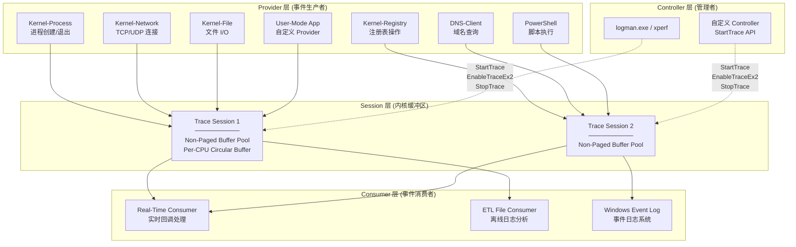
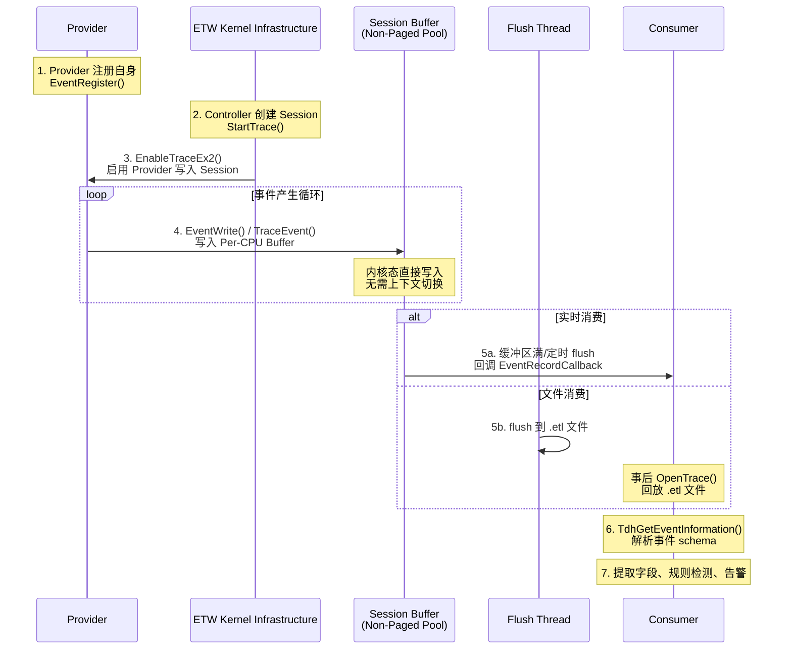
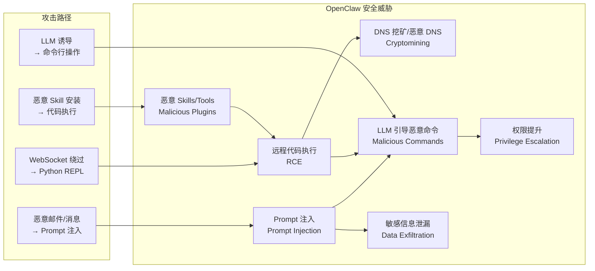
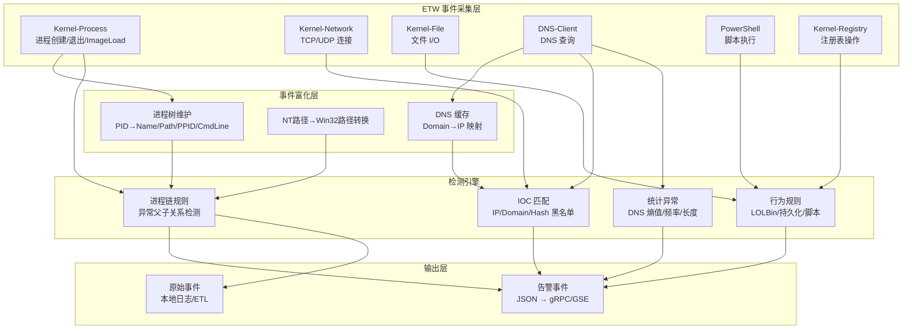
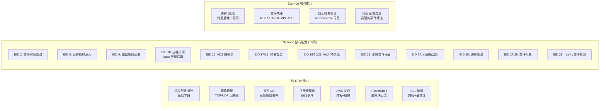

# Windows ETW 深度解析：架构、安全检测与工程实践

## 面向 OpenClaw/LLM 场景的 HIDS 基础设施

Posted by pandaychen on March 23, 2026

---

## 0x00 前言

Event Tracing for Windows（ETW）是 Windows 操作系统内建的高性能事件跟踪基础设施，从 Windows 2000 起引入，经过二十余年的演进，已成为 Windows 平台上最重要的可观测性机制。对于熟悉 Linux 生态的开发者而言，**ETW 之于 Windows，正如 eBPF 之于 Linux**——它们都提供了从内核到用户态的统一事件采集管道，且都不需要修改被监控程序的代码。

本文的写作背景和目标：

```
背景约束：
├── 平台: Windows 10/11 云桌面 (~1w 台)
├── 安全产品: 无 EDR
├── 技术路线: ETW 优先 (纯用户态，无内核驱动)
├── 开发语言: Go （前期） / Rust (后期)
├── LLM 场景: OpenClaw 原生进程 → 远程 LLM 调用
└── 目标: 采集 + 检测 + 告警 (不拦截)
```

本文将从以下几个维度进行深入讲解：

1. **ETW 架构与核心组件**：Provider、Controller、Session、Consumer 四大角色的职责与交互
2. **安全监控核心 Provider**：6 个关键 Provider 的 GUID、事件 ID、字段含义
3. **OpenClaw 安全威胁模型**：结合真实 CVE 和攻击面，构建 ETW 检测矩阵
4. **Sysmon 增益分析**：使用与不使用 Sysmon 的能力差异对比

> 参考资料：[Microsoft ETW 官方文档](https://learn.microsoft.com/en-us/windows/win32/etw/about-event-tracing)、[ETW Provider Names and GUIDs](https://learn.microsoft.com/en-us/archive/blogs/dcook/etw-provider-names-and-guids)、[repnz/etw-providers-docs](https://github.com/repnz/etw-providers-docs)

## 0x01 ETW 架构概览

#### 三层架构模型

ETW 的架构由四个核心角色组成，形成一个 **Provider → Session → Consumer** 的数据管道，其中 Controller 负责 Session 的生命周期管理：



#### 内核态与用户态双层覆盖

ETW 同时覆盖内核态和用户态两个层面：

| 层面 | 数据来源 | 典型事件 | 性能特点 |
|------|----------|----------|----------|
| **内核态** | 内核内建的 Provider（如 Kernel-Process/Network/File/Registry） | 进程创建、线程调度、磁盘 I/O、网络连接、中断、上下文切换 | 零拷贝写入内核缓冲区，极低开销 |
| **用户态** | 应用程序注册的 Provider（如 PowerShell、DNS-Client、.NET CLR） | 脚本执行、DNS 查询、GC 事件、HTTP 请求 | 通过 `NtTraceEvent` 系统调用写入内核缓冲区 |

两个层面的事件最终都汇入同一个 Session 的内核缓冲区，Consumer 无需区分事件来源。

#### ETW 事件的完整生命周期



### 从 Linux HIDS 迁移到 Windows HIDS 的关键认知差异

1. **进程树必须自行维护**：这是最大的工程挑战。Linux 内核提供完整的进程树结构，Windows 只给 PPID。需要在 Agent 启动时做全量快照，运行时通过 ETW 增量维护

2. **命令行获取有陷阱**：ETW 的 CommandLine 可能为空或截断。需要同时准备 ETW + API 两种获取路径

3. **内存监控能力严重受限**：没有 PPL 签名就无法使用 Threat-Intelligence Provider，VirtualProtect 等关键注入检测事件不可用。这是纯用户态方案最大的短板

4. **ID 体系完全不同**：放弃 uid/gid 思维，转向 SID + Token + Integrity Level 体系

5. **文件路径需要转换**：ETW 给出的是 NT 内核路径，必须转换为 Win32 路径才对用户有意义

6. **DNS 采集反而更简单**：DNS-Client ETW Provider 直接给结构化数据，比 Linux 自行解析 DNS payload 方便

总结：

-   Linux HIDS：需要什么就去hook什么
-   Windows etw：给什么就只能用什么

## 0x02 核心组件详解

### Provider（事件提供者）

Provider 是 ETW 事件的生产者，负责在特定条件下生成事件数据。Windows 系统内建了超过 **1100 个** Provider，涵盖内核、网络、存储、安全、应用等几乎所有子系统。

#### Provider 的四种类型

| 类型 | 引入版本 | 特点 | 典型代表 |
|------|----------|------|----------|
| **MOF (Classic)** | Windows 2000 | 最早的 Provider 类型，使用 WMI MOF 定义事件 schema | NT Kernel Logger |
| **WPP (Windows Software Trace Preprocessor)** | Windows XP | 面向驱动/内核开发的 trace 宏，编译时生成 | 各种内核驱动的 debug trace |
| **Manifest-based** | Windows Vista | 使用 XML manifest 定义事件 schema，支持结构化数据 | Microsoft-Windows-Kernel-Process、DNS-Client |
| **TraceLogging** | Windows 10 | 自描述事件，无需预定义 manifest，schema 嵌入事件数据 | 现代 Windows 组件 |

在安全监控场景中，主要消费的是 **Manifest-based** 和 **TraceLogging** 类型的 Provider。

#### GUID 体系

每个 Provider 通过一个全局唯一的 GUID 来标识。例如：

```
Microsoft-Windows-Kernel-Process : {22FB2CD6-0E7B-422B-A0C7-2FAD1FD0E716}
Microsoft-Windows-DNS-Client     : {1C95126E-7EEA-49A9-A3FE-A378B03DDB4D}
```

可通过以下方式查询系统中注册的 Provider：

```powershell
# 列出所有已注册的 Provider
logman query providers

# 查询特定 Provider 的详细信息（支持的 Keyword、Level）
logman query providers "Microsoft-Windows-Kernel-Process"

# PowerShell 方式
Get-EtwTraceProvider
```


### Controller（控制器）

Controller 负责 Trace Session 的全生命周期管理，它不消费事件，只负责"指挥"。

#### Controller 的核心职责

1. **创建 Session**：调用 `StartTrace` 分配内核缓冲区
2. **启用 Provider**：调用 `EnableTraceEx2` 将 Provider 绑定到 Session
3. **配置参数**：设置缓冲区大小、flush 间隔、日志文件路径
4. **停止 Session**：调用 `StopTrace` 释放资源

#### 常用 Controller 工具

| 工具 | 来源 | 用途 |
|------|------|------|
| `logman.exe` | Windows 内建 | 管理 ETW Session，查询 Provider，启停 trace |
| `xperf.exe` | Windows Performance Toolkit | 性能分析专用，支持内核 trace |
| `tracert.exe` / `tracelog.exe` | WDK | 驱动开发 trace |
| `wpr.exe` | Windows Performance Recorder | 图形化 trace 录制 |

典型操作示例：

```batch
:: 创建一个实时 Session 并启用 Kernel-Process Provider
logman create trace "MySecurityTrace" -p "Microsoft-Windows-Kernel-Process" 0x10 4 -ets

:: 查询当前活跃的 Session
logman query -ets

:: 停止 Session
logman stop "MySecurityTrace" -ets
```


### Session（会话/缓冲区）

Session 是 ETW 架构中最核心的数据流转载体，它在内核空间维护一组缓冲区，接收 Provider 写入的事件数据。

#### Session 内存模型

```
Session "MyTrace"
├── Per-CPU Buffer[0]  ←── CPU 0 上的 Provider 写入
├── Per-CPU Buffer[1]  ←── CPU 1 上的 Provider 写入
├── Per-CPU Buffer[2]  ←── CPU 2 上的 Provider 写入
├── ...
└── Per-CPU Buffer[N-1]
    │
    ├── 非分页内存 (Non-Paged Pool)
    │   → 确保中断上下文中也能写入
    │   → 不会被换出到磁盘
    │
    ├── 环形缓冲区 (Circular Buffer)
    │   → 缓冲区满时覆盖最旧的事件（文件模式下 flush 到磁盘）
    │
    └── 无锁写入
        → Per-CPU 设计消除了 CPU 间的锁竞争
        → Provider 写入时无需跨 CPU 同步
```

#### Session 关键参数

| 参数 | 默认值 | 说明 |
|------|--------|------|
| BufferSize | 64 KB | 每个缓冲区的大小 |
| MinimumBuffers | CPU 数量 + 2 | 最小缓冲区数量 |
| MaximumBuffers | MinimumBuffers + 20 | 最大缓冲区数量 |
| FlushTimer | 1 秒 | 缓冲区 flush 周期 |
| LogFileMode | 实时/文件/循环 | Session 的工作模式 |

#### Session 数量限制

- Windows 系统最多支持 **64 个并发 ETW Session**（包括系统自身使用的）
- 实际可用的约为 **56-60 个**（系统和安全工具会占用若干）
- 每个 Session 可以绑定 **多个 Provider**
- 建议安全监控使用 **1-3 个 Session**，按 Provider 频率分组（高频/低频分离）


### Consumer（事件消费者）

Consumer 从 Session 中读取和处理事件，支持两种消费模式。

#### 实时消费 vs ETL 文件消费

| 维度 | 实时消费 (Real-Time) | 文件消费 (ETL) |
|------|---------------------|----------------|
| 延迟 | 毫秒级 | 事后分析 |
| API | `OpenTrace` + `ProcessTrace` (实时模式) | `OpenTrace` + `ProcessTrace` (文件模式) |
| 数据完整性 | 可能丢失（缓冲区满时） | 完整（写入文件后消费） |
| 适用场景 | 安全监控、实时告警 | 性能分析、事件回放、取证 |
| 多 Consumer | 一个 Session 只能有一个实时 Consumer | ETL 文件可被多个 Consumer 读取 |

对于 HIDS 安全监控，推荐使用 **实时消费** 模式。

## 0x03 安全监控核心 Provider 详解

本节详细介绍 HIDS 安全监控所需的 6 个核心 ETW Provider，包括每个 Provider 的 GUID、核心事件 ID、以及每个事件包含的字段及其含义。

### 3.1 Microsoft-Windows-Kernel-Process

进程/线程/映像（DLL/EXE）生命周期的核心 Provider，是安全监控的第一优先级数据源。

```
Provider:  Microsoft-Windows-Kernel-Process
GUID:      {22FB2CD6-0E7B-422B-A0C7-2FAD1FD0E716}
Level:     Informational (4)
Keywords:  PROCESS=0x10, THREAD=0x20, IMAGE=0x40
```

#### Event ID 1: ProcessStart（进程创建）

**安全意义**：最重要的安全事件之一，用于检测恶意进程启动、异常父子关系、LOLBin 利用

| 字段名 | 类型 | 含义 |
|--------|------|------|
| ProcessID | UInt32 | 新创建进程的 PID |
| ParentProcessID | UInt32 | 父进程 PID |
| ImageName | UnicodeString | 进程映像的 NT 路径（如 `\Device\HarddiskVolume3\Windows\System32\cmd.exe`） |
| CommandLine | UnicodeString | 完整命令行参数 |
| UserSID | SID | 运行用户的安全标识符 |
| SessionID | UInt32 | 登录会话 ID（0=SYSTEM 会话） |
| CreateTime | FILETIME | 进程创建时间戳 |
| Flags | UInt32 | 创建标志位 |
| MandatoryLabel | SID | 完整性级别标签 |
| PackageFullName | UnicodeString | UWP 应用包名（桌面应用为空） |


#### Event ID 2: ProcessStop（进程退出）

**安全意义**：完成进程生命周期追踪，用于计算进程存活时长（短命进程可能是恶意工具执行后自删除）

| 字段名 | 类型 | 含义 |
|--------|------|------|
| ProcessID | UInt32 | 退出进程的 PID |
| ImageName | UnicodeString | 进程映像路径 |
| ExitCode | UInt32 | 退出码（0=正常） |
| CreateTime | FILETIME | 进程创建时间 |
| ExitTime | FILETIME | 进程退出时间 |
| KernelTime | UInt64 | 内核态 CPU 时间 |
| UserTime | UInt64 | 用户态 CPU 时间 |
| ExitStatus | UInt32 | NT 状态码 |

#### Event ID 3: ThreadStart（线程创建）

**安全意义**：检测远程线程注入（Thread Injection）——一个进程在另一个进程中创建线程

| 字段名 | 类型 | 含义 |
|--------|------|------|
| ProcessID | UInt32 | 线程所属进程的 PID |
| ThreadID | UInt32 | 新创建线程的 TID |
| StartAddr | Pointer | 线程起始地址 |
| Win32StartAddr | Pointer | Win32 层面的起始地址 |
| StackBase | Pointer | 线程栈基址 |
| StackLimit | Pointer | 线程栈限制地址 |
| SubProcessTag | UInt32 | 服务标签（区分 svchost 中的不同服务） |

> 注意：线程事件量极大（每秒可达数万条），安全监控中通常只关注跨进程的远程线程创建。但纯 ETW 无法直接区分本地线程和远程线程，这是 Sysmon EID 8 的增值所在。

#### Event ID 5: ImageLoad（映像加载）

**安全意义**：检测 DLL 侧加载（DLL Side-Loading）、DLL 注入、恶意 DLL 加载

| 字段名 | 类型 | 含义 |
|--------|------|------|
| ProcessID | UInt32 | 加载映像的进程 PID |
| ImageBase | Pointer | 映像加载基地址 |
| ImageSize | Pointer | 映像大小 |
| ImageName | UnicodeString | DLL/EXE 的完整路径 |
| ImageChecksum | UInt32 | PE 校验和 |
| TimeDateStamp | UInt32 | PE 时间戳 |
| DefaultBase | Pointer | 首选加载基址 |
| SignatureLevel | UInt32 | 签名级别 |
| SignatureType | UInt32 | 签名类型 |

#### Event ID 6: ImageUnload（映像卸载）

字段与 ImageLoad 基本一致，记录 DLL 卸载事件，安全价值较低。

### 3.2 Microsoft-Windows-Kernel-Network

网络连接的核心 Provider，提供 TCP/UDP 连接级别的事件。

```
Provider:  Microsoft-Windows-Kernel-Network
GUID:      {7DD42A49-5329-4832-8DFD-43D979153A88}
Level:     Informational (4)
```

#### Event ID 12: ConnectionAttempted（TCP 连接尝试 / 出站）

**安全意义**：检测恶意外连（C2 通信、数据外泄、矿池连接）

| 字段名 | 类型 | 含义 |
|--------|------|------|
| PID | UInt32 | 发起连接的进程 PID |
| size | UInt32 | 数据包大小 |
| daddr | IPv4/IPv6 | 目标 IP 地址 |
| saddr | IPv4/IPv6 | 源 IP 地址 |
| dport | UInt16 | 目标端口 |
| sport | UInt16 | 源端口 |
| connid | Pointer | 连接标识符 |

#### Event ID 15: ConnectionAccepted（TCP 连接接受 / 入站）

字段与 ConnectionAttempted 相同，记录入站连接。

**安全意义**：检测反向 shell、未授权的监听端口、横向移动的入站连接。

#### Event ID 10 / 11: DataSent / DataReceived

| 字段名 | 类型 | 含义 |
|--------|------|------|
| PID | UInt32 | 进程 PID |
| size | UInt32 | 发送/接收的字节数 |
| connid | Pointer | 连接标识符（关联到具体连接） |

#### Event ID 42 / 43: DataSentOverUDP / DataReceivedOverUDP

UDP 协议的数据收发事件，字段与 TCP 类似，额外包含 `daddr`/`dport`/`saddr`/`sport`。

**安全意义**：检测 DNS over UDP（虽然 DNS-Client Provider 更适合）、UDP 隧道。

### 3.3 Microsoft-Windows-Kernel-File

文件系统操作的核心 Provider，提供细粒度的文件 I/O 事件。

```
Provider:  Microsoft-Windows-Kernel-File
GUID:      {EDD08927-9CC4-4E65-B970-C2560FB5C289}
Level:     Informational (4)
Keywords:  FILENAME=0x10, FILEIO=0x20, OP_END=0x40
```

| Event ID | 名称 | 安全意义 |
|----------|------|----------|
| 10 | NameCreate | 文件/目录名创建（注意：这是文件名的内核对象创建，不等同于文件创建） |
| 11 | NameDelete | 文件/目录名删除 |
| 12 | Create | 文件打开操作（`CreateFile` 调用） |
| 13 | Cleanup | 文件句柄关闭前的清理 |
| 14 | Close | 文件句柄关闭 |
| 15 | Read | 文件读取操作 |
| 16 | Write | 文件写入操作 |
| 17 | SetInformation | 设置文件属性 |
| 18 | SetDelete | 标记文件删除 |
| 19 | Rename | 文件重命名 |
| 20 | DirEnum | 目录枚举 |
| 30 | CreateNewFile | 创建新文件 |

#### 核心事件字段（以 Create / Read / Write 为例）

| 字段名 | 类型 | 含义 |
|--------|------|------|
| IrpPtr | Pointer | I/O 请求包指针（用于关联 OperationEnd） |
| FileObject | Pointer | 文件对象内核指针 |
| FileKey | Pointer | 文件唯一标识 |
| TTID | UInt32 | 发起操作的线程 ID |
| CreateOptions | UInt32 | 创建选项标志位 |
| FileAttributes | UInt32 | 文件属性 |
| ShareAccess | UInt32 | 共享访问模式 |
| OpenPath | UnicodeString | 文件完整路径 |
| Offset | UInt64 | 读写偏移量（Read/Write 事件） |
| IoSize | UInt32 | I/O 大小 |
| IoFlags | UInt32 | I/O 标志位 |

> **性能警告**：Kernel-File 是所有 Provider 中事件量最大的，**每秒可产生数千到数万条事件**。生产环境必须做严格的路径过滤（只关注敏感目录如 `%TEMP%`、`%APPDATA%`、用户目录等）。

### 3.4 Microsoft-Windows-Kernel-Registry

注册表操作的核心 Provider。

```
Provider:  Microsoft-Windows-Kernel-Registry
GUID:      {70EB4F03-C1DE-4F73-A051-33D13D5413BD}
Level:     Informational (4)
```

| Event ID | 名称 | 安全意义 |
|----------|------|----------|
| 1 | CreateKey | 创建注册表项 — 检测持久化（Run/RunOnce 键）、服务注册 |
| 2 | OpenKey | 打开注册表项 |
| 3 | DeleteKey | 删除注册表项 |
| 4 | QueryKey | 查询注册表项 |
| 5 | SetValue | 设置注册表值 — **最重要**，检测自启动项修改、服务创建 |
| 6 | DeleteValue | 删除注册表值 |
| 7 | QueryValue | 查询注册表值 |
| 8 | EnumerateKey | 枚举子项 |
| 13 | CloseKey | 关闭注册表项 |

#### 核心事件字段

| 字段名 | 类型 | 含义 |
|--------|------|------|
| KeyObject | Pointer | 注册表键的内核对象指针 |
| Status | UInt32 | 操作返回状态（NTSTATUS） |
| BaseName | UnicodeString | 注册表路径的基础名 |
| RelativeName | UnicodeString | 相对路径名 |
| KeyName | UnicodeString | 完整的注册表路径（需要通过 KeyObject 反向解析） |

> **注意**：Kernel-Registry Provider 的路径字段是内核对象格式（如 `\REGISTRY\MACHINE\SOFTWARE\...`），需要转换为用户态格式（如 `HKLM\SOFTWARE\...`）。

**安全关注的关键注册表路径**：

```
持久化路径:
├── HKLM\SOFTWARE\Microsoft\Windows\CurrentVersion\Run
├── HKCU\SOFTWARE\Microsoft\Windows\CurrentVersion\Run
├── HKLM\SOFTWARE\Microsoft\Windows\CurrentVersion\RunOnce
├── HKLM\SYSTEM\CurrentControlSet\Services\*
└── HKLM\SOFTWARE\Microsoft\Windows NT\CurrentVersion\Winlogon

计划任务:
└── HKLM\SOFTWARE\Microsoft\Windows NT\CurrentVersion\Schedule\TaskCache

安全策略:
└── HKLM\SYSTEM\CurrentControlSet\Control\Lsa
```

### 3.5 Microsoft-Windows-DNS-Client

DNS 查询的 Provider，是网络安全检测的重要数据源。

```
Provider:  Microsoft-Windows-DNS-Client
GUID:      {1C95126E-7EEA-49A9-A3FE-A378B03DDB4D}
Level:     Informational (4)
```

#### Event ID 3008: QueryInitiated（DNS 查询发起）

| 字段名 | 类型 | 含义 |
|--------|------|------|
| QueryName | UnicodeString | 查询的域名（如 `evil.example.com`） |
| QueryType | UInt32 | DNS 记录类型编号 |

#### Event ID 3006: QueryCompleted（DNS 查询完成）

| 字段名 | 类型 | 含义 |
|--------|------|------|
| QueryName | UnicodeString | 查询的域名 |
| QueryType | UInt32 | DNS 记录类型编号 |
| QueryStatus | UInt32 | 查询状态（0=成功，9003=NXDOMAIN） |
| QueryResults | UnicodeString | 查询结果（IP 地址等，多个结果以分号分隔） |

**DNS 记录类型编号对照表**：

| QueryType 值 | 名称 | 含义 |
|--------------|------|------|
| 1 | A | IPv4 地址 |
| 2 | NS | 域名服务器 |
| 5 | CNAME | 别名记录 |
| 6 | SOA | 权威起始记录 |
| 12 | PTR | 反向解析 |
| 15 | MX | 邮件交换 |
| 16 | TXT | 文本记录（常被滥用于 DNS 隧道） |
| 28 | AAAA | IPv6 地址 |
| 33 | SRV | 服务定位 |
| 65 | HTTPS | HTTPS 服务绑定 |
| 255 | ANY | 查询所有类型 |

**安全检测场景**：

| 检测目标 | QueryName 特征 |
|----------|---------------|
| 矿池连接 | `*pool*`, `*xmr*`, `*monero*`, `*mining*` |
| DGA 域名 | 高熵随机字符串域名 |
| DNS 隧道 | 超长子域名 + 高频 TXT 查询 |
| C2 通信 | 已知恶意域名黑名单匹配 |
| 恶意重定向 | 查询结果包含已知恶意 IP |

> **优势**：DNS-Client 事件包含 **ProcessID** 信息（在 Event Header 中），可以关联到发起 DNS 查询的具体进程。结合进程树，可以追溯到完整的 OpenClaw → Python → DNS 查询链路。

### 3.6 Microsoft-Windows-PowerShell

PowerShell 脚本执行的 Provider，对于检测 LLM 引导的恶意脚本至关重要。

```
Provider:  Microsoft-Windows-PowerShell
GUID:      {A0C1853B-5C40-4B15-8766-3CF1C58F985A}
Channel:   Microsoft-Windows-PowerShell/Operational
```

#### Event ID 4104: ScriptBlockLogging（脚本块日志）

**安全意义**：记录完整的 PowerShell 脚本内容，是检测无文件攻击（fileless attack）的关键数据源

| 字段名 | 类型 | 含义 |
|--------|------|------|
| ScriptBlockId | GUID | 脚本块唯一标识（大脚本拆分时用于关联） |
| ScriptBlockText | UnicodeString | **脚本内容**（最关键的字段） |
| Path | UnicodeString | 脚本文件路径（交互式输入为空） |
| MessageNumber | UInt32 | 分片序号（大脚本拆为多个事件） |
| MessageTotal | UInt32 | 分片总数 |

> **重要限制**：ETW 单事件最大约 **64 KB**，PowerShell 脚本超过约 32 KB 时会拆分为多个 4104 事件。需要根据 `ScriptBlockId` 拼接还原完整脚本。

#### Event ID 4105 / 4106: ScriptBlock Invocation Start / Complete

记录脚本块的执行开始和结束，包含 `ScriptBlockId` 和 `RunspaceId`，用于构建执行时间线。

#### PowerShell ETW 的特殊性

PowerShell ScriptBlock Logging 需要 **显式启用**（Windows 默认不记录）：

```
方法一: 组策略 (推荐批量部署)
  Computer Configuration
  → Administrative Templates
  → Windows Components
  → Windows PowerShell
  → Turn on PowerShell Script Block Logging: Enabled

方法二: 注册表
  HKLM\SOFTWARE\Policies\Microsoft\Windows\PowerShell\ScriptBlockLogging
  EnableScriptBlockLogging = 1
```

启用后，所有 PowerShell 执行都会被记录，包括：
- 交互式命令
- 脚本文件执行
- `-EncodedCommand` 编码执行（会被解码后记录）
- 模块中的函数调用

## 0x04 ETW 事件枚举与发现

在开发 ETW 消费程序之前，需要知道系统中有哪些 Provider 可用，以及每个 Provider 提供哪些事件。

### 命令行枚举

```powershell
# 列出系统所有已注册的 Provider（通常 1100+ 个）
logman query providers

# 查询特定 Provider 的详细信息
logman query providers "Microsoft-Windows-Kernel-Process"
# 输出: GUID, Keywords, Levels, 关联的 Session 等

# 列出当前活跃的 ETW Session
logman query -ets

# PowerShell: 列出网络相关的 Provider
Get-NetEventProvider -ShowInstalled | Where-Object {$_.Name -like "*DNS*"}
```

### ETW Explorer 工具

[ETW Explorer](https://github.com/zodiacon/EtwExplorer)（Pavel Yosifovich 开发）是一个图形化的 ETW Provider 浏览工具，可以：

- 浏览所有已注册的 Provider
- 查看每个 Provider 的事件 schema（事件 ID、字段名、字段类型）
- 实时监听 Provider 的事件输出


####    总结：可以实现的采集

-   进程/线程
-   dns（查询与返回结果）
-   网络连接（入站+出战）
-   注册表（crud）
-   powershell（脚本内容审计），需要手动启用

## 0x05 OpenClaw 安全威胁模型

OpenClaw 是当前最流行的开源 AI 助手框架，但其架构设计存在严重的安全隐患。截至 2026 年 2 月，公开数据显示：

- **40,000 - 135,000+** 个 OpenClaw 实例暴露在公网
- **93.4%** 的公开实例存在关键认证绕过（反向代理配置错误）
- **CVE-2026-25253**（高危）：WebSocket 认证绕过，Guest 模式保留 Python REPL 权限

### 威胁清单

基于 OpenClaw 的架构特性和公开漏洞，在 Win10/11 云桌面环境中需要关注以下威胁：



### 各威胁详细说明

#### 1. Prompt 注入 (Prompt Injection)

**攻击方式**：通过聊天消息、邮件 hook、Skill 输出等途径注入恶意指令，诱导 LLM 执行非预期操作。OpenClaw 的安全策略明确指出 prompt injection "explicitly out-of-scope"，这意味着框架本身不做任何防御。

**攻击示例**：恶意邮件通过 Gmail hook 被 OpenClaw 读取 → 邮件内容包含隐藏的 prompt 指令 → LLM 执行 Python REPL 调用 → 零点击 RCE。

#### 2. 远程代码执行 (RCE)

**CVE-2026-25253**：WebSocket 连接缺少 Authorization header 时，服务端降级为 Guest 模式，但 Guest 仍保留调用 Python REPL 等工具的权限。加上缺少 Origin header 校验，攻击者可通过钓鱼页面触发。

**默认危险权限**：OpenClaw 默认允许 agent 执行任意 shell 命令、读写文件、自动化浏览器、修改自身配置（SOUL.md）。

#### 3. DNS 挖矿 / 恶意 DNS

**攻击方式**：通过 RCE 或恶意 Skill 下载挖矿程序，连接矿池域名。或者通过 DNS 隧道进行 C2 通信。

#### 4. LLM 引导恶意命令执行

**攻击方式**：LLM 在处理恶意输入后，通过 OpenClaw 的 shell 执行能力运行 `powershell.exe -enc <base64>`、`certutil -urlcache`、`bitsadmin /transfer` 等 LOLBin 命令。

#### 5. 敏感信息泄漏

**攻击方式**：LLM 被诱导读取 API 密钥、凭据文件、环境变量等敏感数据，并通过聊天消息或网络请求外泄。Moltbook 事件中已有 **150 万 API token** 被泄漏的先例。

#### 6. 恶意 Skills / Tools

**攻击方式**：OpenClaw 支持从外部源下载和安装 Skill，恶意 Skill 可能包含后门代码。安装后，Skill 在 OpenClaw 进程的权限上下文中运行。

## 0x06 ETW 检测矩阵

### 风险 → Provider → 事件 → 检测规则 映射

| 威胁 | 主要 Provider | 事件 | 检测逻辑 | 置信度 |
|------|--------------|------|----------|--------|
| **RCE / 恶意命令执行** | Kernel-Process | EID 1 ProcessStart | OpenClaw 进程树（python.exe/node.exe）下派生 cmd.exe/powershell.exe | 高 |
| **Encoded PS 执行** | Kernel-Process | EID 1 ProcessStart | CommandLine 包含 `-enc`/`-encodedcommand` | 高 |
| **LOLBin 利用** | Kernel-Process | EID 1 ProcessStart | certutil/mshta/rundll32/regsvr32 + 可疑参数 | 高 |
| **DNS 挖矿** | DNS-Client | EID 3006 QueryCompleted | QueryName 匹配矿池域名模式 (`*pool*`, `*xmr*`, `*monero*`) | 高 |
| **DGA 域名** | DNS-Client | EID 3006 QueryCompleted | 域名长度异常 + 字符熵值高 + 非常见 TLD | 中 |
| **DNS 隧道** | DNS-Client | EID 3006/3008 | 高频 TXT 查询 + 超长子域名 (>40字符) | 中 |
| **C2 外连** | Kernel-Network | EID 12 ConnectionAttempted | 目标 IP/端口匹配 IOC 黑名单 | 高 |
| **数据外泄** | Kernel-Network | EID 10 DataSent | 大量数据发送到非业务 IP + Kernel-File 读敏感文件 | 中 |
| **敏感文件读取** | Kernel-File | EID 15 Read / EID 12 Create | 读取 `.env`/`credentials`/`*key*`/`*token*` 等路径 | 中 |
| **文件投放** | Kernel-File | EID 30 CreateNewFile | 在 `%TEMP%`/`%APPDATA%` 下创建 .exe/.dll/.ps1/.bat | 高 |
| **持久化** | Kernel-Registry | EID 5 SetValue | 修改 Run/RunOnce/Services 注册表键 | 高 |
| **恶意脚本** | PowerShell | EID 4104 ScriptBlock | 脚本内容匹配：`Net.WebClient`/`IEX`/`Invoke-Expression`/`[Convert]::FromBase64String` | 高 |
| **恶意 DLL** | Kernel-Process | EID 5 ImageLoad | 非系统目录 DLL 加载 + 未签名 | 中 |
| **宏攻击** | Kernel-Process | EID 1 ProcessStart | Office 进程（winword/excel）派生 shell 或脚本引擎 | 高 |

### 检测流程图



### ETW 检测的能力边界

以下场景 ETW 无法直接检测，需要补充其他手段：

| 场景 | ETW 局限 | 补充方案 |
|------|----------|----------|
| 进程内存注入（Process Hollowing） | Kernel-Process 只记录线程创建，不记录内存写入 | Sysmon EID 25 / 内核驱动 |
| 加密流量内容 | Kernel-Network 只记录连接元数据 | 网络流量解密 / SSL 检查 |
| Prompt 注入的语义分析 | ETW 不理解自然语言 | LLM 安全层 / 输入过滤 |
| 用户行为意图 | ETW 只记录系统事件 | UEBA / 用户行为分析 |


## 0x07 Sysmon 深度对比分析

Sysmon（System Monitor）是 Microsoft Sysinternals 工具套件中的系统监控工具，通过安装内核驱动来增强 Windows 的事件记录能力，并将事件写入 `Microsoft-Windows-Sysmon/Operational` Event Log。

### Sysmon 完整事件 ID 列表（截至 2025 版本，共 29 个）

| EID | 事件名称 | 说明 | 纯 ETW 替代方案 |
|-----|----------|------|-----------------|
| 1 | **Process Create** | 进程创建，含完整命令行、哈希(MD5/SHA256/IMPHASH)、进程 GUID、父进程信息 | Kernel-Process EID 1（无哈希、无 GUID） |
| 2 | **File Creation Time Changed** | 文件创建时间被修改（timestomping 检测） | **无替代** |
| 3 | **Network Connection** | TCP/UDP 连接，含进程 GUID 关联，默认禁用 | Kernel-Network EID 10-43 |
| 4 | **Sysmon Service State Changed** | Sysmon 服务自身状态变更 | N/A |
| 5 | **Process Terminated** | 进程退出 | Kernel-Process EID 2 |
| 6 | **Driver Loaded** | 驱动加载，含签名信息 | **无直接替代**（Kernel-Process EID 5 仅部分覆盖） |
| 7 | **Image Loaded** | DLL 加载，含**签名验证**和哈希 | Kernel-Process EID 5（无签名验证、无哈希） |
| 8 | **CreateRemoteThread** | **远程线程创建**（代码注入检测） | **无替代**（Kernel-Process EID 3 无法区分本地/远程线程） |
| 9 | **RawAccessRead** | 磁盘原始读取（绕过文件系统） | **无替代** |
| 10 | **ProcessAccess** | **进程间访问**（凭据窃取检测，如 lsass.exe 访问） | **无替代** |
| 11 | **FileCreate** | 文件创建 | Kernel-File EID 30 |
| 12 | **RegistryEvent (Create/Delete)** | 注册表键创建/删除 | Kernel-Registry EID 1/3 |
| 13 | **RegistryEvent (Value Set)** | 注册表值修改 | Kernel-Registry EID 5 |
| 14 | **RegistryEvent (Rename)** | 注册表键/值重命名 | Kernel-Registry（部分覆盖） |
| 15 | **FileCreateStreamHash** | NTFS 交替数据流创建（ADS 检测） | **无替代** |
| 16 | **Sysmon Config State Changed** | Sysmon 配置变更 | N/A |
| 17 | **PipeEvent (Create)** | **命名管道创建** | **无替代** |
| 18 | **PipeEvent (Connect)** | **命名管道连接** | **无替代** |
| 19 | **WmiEvent (Filter)** | **WMI 事件过滤器创建** | **无替代**（需 WMI ETW Provider，配置复杂） |
| 20 | **WmiEvent (Consumer)** | **WMI 事件消费者创建** | **无替代** |
| 21 | **WmiEvent (Binding)** | **WMI 过滤器-消费者绑定** | **无替代** |
| 22 | **DNS Query** | DNS 查询 | DNS-Client EID 3006/3008 |
| 23 | **FileDelete (Archived)** | 文件删除（**保存被删文件副本**） | **无替代**（文件内容保存是 Sysmon 独有能力） |
| 24 | **Clipboard Change** | **剪贴板内容变更** | **无替代** |
| 25 | **Process Tampering** | **进程映像篡改**（Process Hollowing/Herpaderping 检测） | **无替代** |
| 26 | **File Delete Logged** | 文件删除事件记录 | Kernel-File EID 18 |
| 27 | **File Block Executable** | **阻止可执行文件创建**（主动防御） | **无替代**（ETW 仅采集不拦截） |
| 28 | **File Block Shredding** | **阻止文件粉碎** | **无替代** |
| 29 | **File Executable Detected** | 可执行文件检测 | **无替代** |

### 能力矩阵对比



### 关键差异分析

#### 对 OpenClaw 安全检测的影响

| 检测场景 | 纯 ETW 效果 | 加 Sysmon 增益 |
|----------|-------------|---------------|
| OpenClaw → shell 派生 | **可检测** (Kernel-Process EID 1) | 增加进程 GUID、哈希、更完整的命令行 |
| PowerShell 编码执行 | **可检测** (EID 4104 + EID 1) | 无显著增益 |
| LOLBin 利用 | **可检测** (Kernel-Process EID 1) | 增加文件哈希辅助确认 |
| DNS 挖矿 | **可检测** (DNS-Client EID 3006) | Sysmon EID 22 更简洁但无增益 |
| DLL 注入 | **部分检测** (EID 5 ImageLoad) | **显著增益**: Sysmon EID 7 带签名验证 |
| 进程注入 (Hollowing) | **无法检测** | **关键能力**: Sysmon EID 8/10/25 |
| WMI 持久化 | **无法检测** | **关键能力**: Sysmon EID 19/20/21 |
| 命名管道 (C2 通信) | **无法检测** | **关键能力**: Sysmon EID 17/18 |
| 凭据窃取 (lsass) | **无法检测** | **关键能力**: Sysmon EID 10 |

#### Sysmon 的代价

| 维度 | 影响 |
|------|------|
| **部署复杂度** | 需要安装驱动（`sysmon64.exe -i config.xml`），需要管理员权限 + 驱动签名信任 |
| **配置管理** | 需要维护 XML 配置文件，不同终端可能需要不同配置 |
| **性能开销** | 中等，取决于配置。全量事件可能占用 5-10% CPU |
| **更新维护** | 需要定期更新 Sysmon 版本 + 更新配置 |
| **被攻击面** | Sysmon 驱动本身可能被绕过（驱动卸载、配置篡改、BYOVD） |
| **许可证** | Sysmon 是免费工具，但不开源 |
